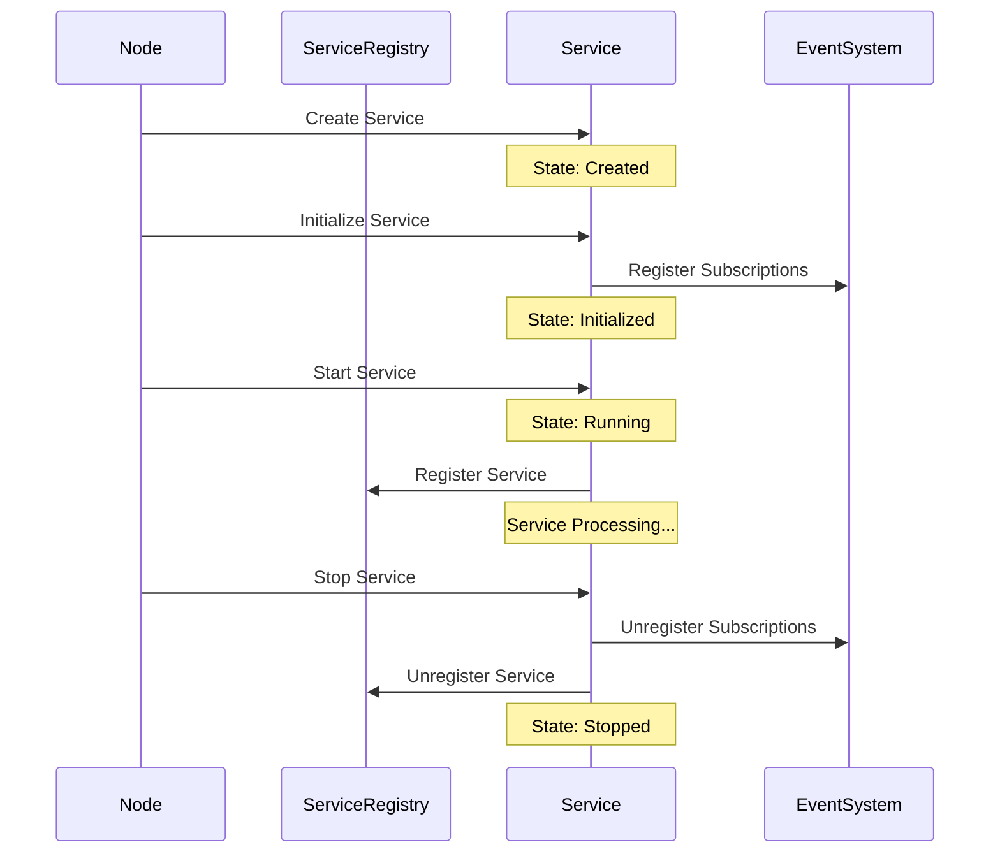
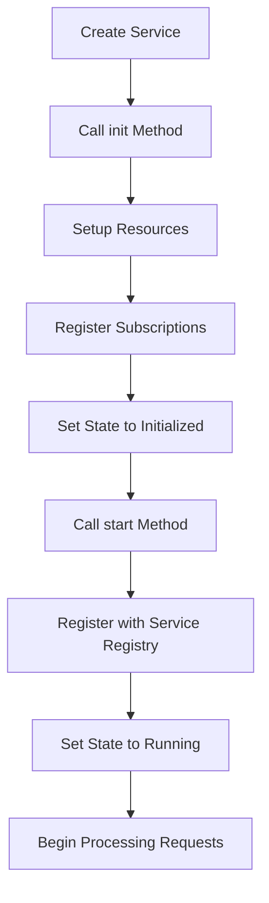

# Kagi Node System Architecture

This document describes the high-level architecture of the Kagi node system, including core components, data flow patterns, design principles, and implementation guidelines.

## Table of Contents

1. [Introduction](#introduction)
2. [Core Components](#core-components)
   - [Node](#node)
   - [Service Registry](#service-registry)
   - [Abstract Service](#abstract-service)
   - [Request Context](#request-context)
   - [Logging System](#logging-system)
   - [Database System](#database-system)
   - [IPC System](#ipc-system)
3. [Data Flow Patterns](#data-flow-patterns)
   - [Request/Response Pattern](#requestresponse-pattern)
   - [Publish/Subscribe Pattern](#publishsubscribe-pattern)
4. [Design Principles](#design-principles)
   - [Service Organization](#service-organization)
   - [Communication Patterns](#communication-patterns)
   - [Event Handler Lifecycle](#event-handler-lifecycle-management)
   - [Implementation Guidelines](#implementation-guidelines)
   - [Service Implementation Patterns](#service-implementation-patterns)
5. [Service Lifecycle Management](#service-lifecycle-management)
   - [Service Initialization](#service-initialization)
   - [Subscription Management](#subscription-management)
6. [P2P Architecture](#p2p-architecture)
   - [Service Discovery](#service-discovery)
   - [Peer-to-Peer Communication](#peer-to-peer-communication)
   - [Network Configuration](#network-configuration)
7. [Security Considerations](#security-considerations)
   - [Authentication](#authentication)
   - [Authorization](#authorization)
   - [Secure Communication](#secure-communication)

## Introduction

The Kagi node system follows a modular, service-oriented architecture designed for flexibility, extensibility, and robust operation in distributed environments. This document provides an overview of the key components and principles governing the system design.

## Core Components

### Node

The central component that manages services and provides core functionality:

- Defined in `node.rs`
- Contains configuration, service management, and network operations
- Acts as the main entry point for the application
- Provides interfaces for service communication and event handling

### Service Registry

Manages service registration, discovery, and communication:

- Defined in `services/registry.rs`
- Maintains a map of registered services
- Routes requests to appropriate services
- Handles publish/subscribe for events
- Manages remote service discovery and communication

### Abstract Service

Base trait implemented by all services:

- Defined in `services/abstract_service.rs`
- Provides unified lifecycle management (init, start, stop)
- Standardizes request processing
- Defines service state transitions

### Request Context

Context for service requests:

- Handles path routing and parameter passing
- Provides a uniform interface for service communication
- Enables service-to-service communication
- Manages event subscription and publishing

### Logging System

Component-based logging for debugging and monitoring:

- Defined in `util/logging.rs`
- Categorizes logs by system component
- Supports multiple log levels
- Provides structured logging capabilities

### Database System

SQLite-based storage layer:

- Defined in `db.rs` and `services/sqlite.rs`
- Provides persistence for system data
- Supports CRUD operations and queries
- Manages database connections and transactions

### IPC System

Client-server communication:

- Facilitates communication with external processes
- Implements secure inter-process communication
- Provides APIs for external service integration

## Data Flow Patterns

The Kagi node system follows two primary data flow patterns:

### Request/Response Pattern

1. **Client Request**
   - Requests begin in the `RequestContext` with a path and parameters
   - The `NodeRequestHandlerImpl` parses the path into service name and operation
   - Requests are routed to appropriate services through the registry
   - Services process requests and return responses
   - Responses flow back through the handler to the client

2. **Request Routing Flow**
   ```
   Client → Node → ServiceRegistry → TargetService → process_request() → Response
   ```

### Publish/Subscribe Pattern

1. **Event Publication**
   - Publishers emit events to specific topics
   - The service registry manages topic subscriptions
   - Subscribers receive events when published to their topics
   - Events include metadata like timestamps
   - Subscribers process events based on topic and content

2. **Event Flow**
   ```
   Publisher → Node → ServiceRegistry → Topic Subscribers → Event Handlers
   ```

## Design Principles

### Service Organization

- Each functionality should be implemented as a dedicated service
- Services should be self-contained and follow the single responsibility principle
- Avoid conditional routing within services - use dedicated services for different functionalities
- Information services should be separate from their data sources (e.g., `RegistryInfoService` separate from `ServiceRegistry`)
- Use delegation pattern when a service needs to expose data from another component

### Communication Patterns

#### Request/Response

- All service requests must include a `RequestContext`
- Path format should be "serviceName/operation" to enable proper routing
- `NodeRequestHandler` should parse the path to extract service name and operation
- Services should process requests based on the operation field

#### Publish/Subscribe

- Publish operations should mirror request pattern (same path parsing, context handling)
- No response is expected from publish operations
- Event handlers should receive the same context as request handlers
- Context allows event handlers to make additional service calls or trigger events
- Subscribe operations should use the complete path (e.g., "user/created")
- Service name should be extracted from path using the same mechanism as requests
- Each topic should have a clear ownership model (which service owns which topics)

##### Subscription Processing
- When subscribing from within a service, the service name is implied and can be omitted
- When subscribing directly from a Node without a service context, an anonymous service is created
- Anonymous subscribers are registered in the ServiceRegistry with a unique service name
- This ensures all subscribers are tied to a service, maintaining a consistent architecture
- Anonymous services are implemented as fully-functional AbstractService instances

##### Subscription Propagation
- When a node subscribes to a topic, the subscription should be stored in the local registry
- All non-internal services (events and actions) (topics not starting with "internal/") should be propagated to all connected peers
- Internal topics are meant for local node usage only and should not be shared across the network
- This ensures that peers are aware of what topics each node is interested in
- Propagating subscriptions allows nodes to route events across the network efficiently
- When a node receives a remote subscription, it should record it for future event routing

### Event Handler Lifecycle Management

- Event handlers remain active until explicitly unregistered using:
  - `node.unsubscribe(topic, [handler_id])` at the Node level
  - `context.unsubscribe(topic, [handler_id])` from within a RequestContext
- One-time event handlers that auto-unregister after being triggered once:
  - `node.once(topic, callback)` at the Node level
  - `context.once(topic, callback)` from within a RequestContext
- Advanced subscription options via `subscribe_with_options()`:
  - Supports TTL (time-to-live) for automatic cleanup after a specified duration
  - Supports max_triggers to automatically unregister after being triggered N times
  - Supports conditional unsubscribe based on callback return value
- Anonymous services for subscriptions are subject to the following lifecycle:
  - Created when a subscription is registered without a service context
  - Remain active as long as they have at least one active subscription
  - Can be manually unregistered or expire based on subscription options
  - Periodic cleanup removes services with no active subscriptions

### Implementation Guidelines

- Maintain consistent path handling across all communication patterns
- Make service boundaries explicit and well-defined
- Services should expose clear interfaces through their operations
- Prefer composition over inheritance when extending functionality

### Service Implementation Patterns

**Service Operation Delegation:**
- The `process_request` method should match on the operation name and delegate to local methods
- Local method names should match the operation names for clarity and traceability
- Example: `operation "get_data"` should call a local method named `get_data()`
- This improves code organization, readability, and testability
- Complex operation implementations should be moved out of the `process_request` method
- Each operation should have a single, focused implementation method

## Service Lifecycle Management

The following diagram illustrates the lifecycle of a service in the Kagi node system:



### Service Initialization

The following diagram illustrates the service initialization flow:



**Subscription Setup:**
- Service subscriptions should be established during the initialization phase (`init` method)
- The `init` method MUST receive a RequestContext parameter to enable subscription registration
- Subscriptions should NEVER be set up in the `process_request` method
- Reasons for this pattern:
  - Ensures subscriptions are set up exactly once when the service starts
  - Prevents redundant subscription setup on every request
  - Maintains clear separation of concerns in the service lifecycle
  - Improves performance by avoiding unnecessary subscription checks
- If a service needs to verify subscriptions are active, use a private method that checks state rather than attempting to re-subscribe
- For dynamic subscriptions that depend on runtime parameters, create dedicated operations for subscription management

**Service Initialization Flow:**
- Services should have a predictable initialization flow: create → init → start
- The `init` method is where all one-time setup like subscriptions should occur
- The `start` method should focus on activating the service's functionality
- Subscriptions registered during `init` should follow the service's lifecycle
- When a service is stopped, its subscriptions should be unregistered

## P2P Architecture

### Service Discovery

The Kagi node system implements a comprehensive service discovery mechanism across the P2P network:

- **Service Advertisement**: Services are automatically advertised to connected peers when registered
- **Remote Service Discovery**: Services are discovered when connecting to peers in the P2P network
- **Service Lookup**: The Node provides a `wait_for_service` method to wait for service availability
- **Service Availability**: Services can be local or remote, with transparent access through the service registry
- **Timeout Support**: Service discovery includes timeout mechanisms to prevent indefinite waiting

```rust
// Wait for a service to become available with a 5-second timeout
let service_available = node.wait_for_service("remote_service", Some(5000)).await;
if service_available {
    // Service is ready to use
} else {
    // Handle service unavailable
}
```

### Peer-to-Peer Communication

The P2P layer in Kagi nodes implements the following features:

- **Transport Protocol**: QUIC-based transport for reliable, secure, and multiplexed communication
- **Peer Identification**: Peers are identified by a PeerId derived from their public key
- **Network Participation**: Peers can participate in multiple networks with network-specific keys
- **Access Control**: Network access is controlled through cryptographic AccessTokens
- **Message Routing**: Messages are routed to appropriate services across the P2P network
- **Discovery Mechanism**: Peers discover each other using UDP multicast and DHT routing
- **NAT Traversal**: STUN-like server and UDP hole punching for connectivity across NATs

### Network Configuration

P2P functionality in Kagi nodes is configured through the Node configuration:

```rust
// Example P2P configuration
let p2p_config = TransportConfig {
    network_id: "network_id".to_string(),
    state_path: "state_path".to_string(),
    bootstrap_nodes: Some(vec!["127.0.0.1:50601".to_string()]),
    listen_addr: Some("127.0.0.1:50602".to_string()),
};

// Create and initialize node with P2P support
let mut node = Node::new(NodeConfig {
    node_id: "my_node".to_string(),
    data_dir: "./data".to_string(),
    db_path: "./data/db".to_string(),
    p2p_config: Some(p2p_config),
}).await?;
```

## Security Considerations

### Authentication

- Services should authenticate requests when necessary
- P2P connections require mutual authentication through AccessTokens
- Authentication should be performed at the service boundary

### Authorization

- Services should implement appropriate authorization checks
- Access to sensitive operations should be restricted
- Access control should be enforced consistently across all services

### Secure Communication

- All P2P communication uses QUIC with TLS for encryption
- Service-to-service communication within a node is memory-safe
- External communication channels should be properly secured


## Examples

This section will be expanded with practical examples.
