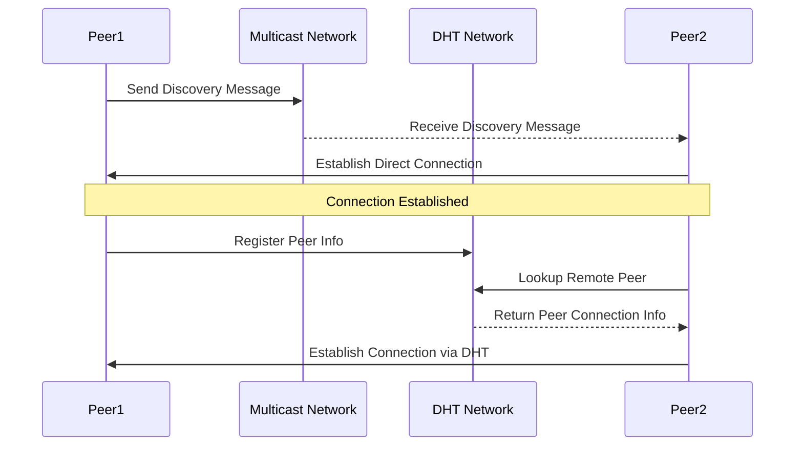
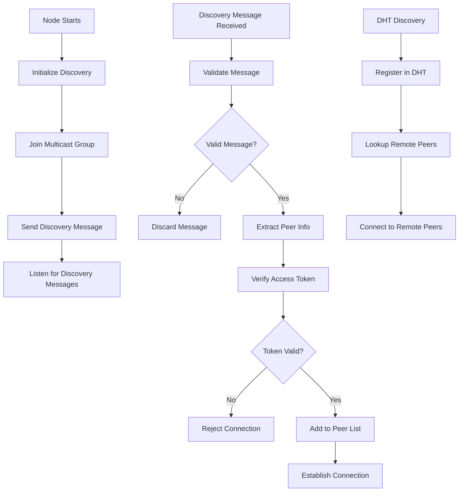

# Discovery Mechanism Specification

This specification defines the discovery mechanism for the P2P network, allowing peers to locate each other on the same local network using UDP multicast. It includes secure validation of discovery messages to ensure only authorized peers are considered for connection.

## Table of Contents

1. [Introduction](#introduction)
2. [Discovery Method](#discovery-method)
3. [Multicast Group](#multicast-group)
4. [Discovery Message](#discovery-message)
5. [AccessToken in Discovery](#accesstoken-in-discovery)
6. [Sending Discovery Messages](#sending-discovery-messages)
7. [Receiving Discovery Messages](#receiving-discovery-messages)
8. [Security](#security)
9. [References Between Specifications](#references-between-specifications)

## Introduction

This specification defines the discovery mechanism for the P2P network, allowing peers to locate each other on the same local network using UDP multicast. It includes secure validation of discovery messages to ensure only authorized peers are considered for connection.

The following diagram illustrates the P2P discovery and connection process:



The following flow diagram illustrates the complete discovery process:



## Discovery Method

- **UDP Multicast**: Peers periodically announce their presence and listen for announcements within the local network.

## Multicast Group

- **Address**: 239.255.255.250
- **Port**: 4445

## Discovery Message

- **Format**: JSON

- **Structure**:
  ```json
  {
    "peer_id": "base64_peer_id",
    "networks": [
      {
        "network_id": "base64_network_id",
        "token": "base64_access_token"
      }
    ],
    "ip": "peer_ip_address",
    "port": "peer_tcp_port",
    "timestamp": "unix_timestamp",
    "version": "protocol_version"
  }
  ```

- **Fields**:
  - `peer_id`: Base64-encoded SHA-256 hash of the peer's Ed25519 public key (see Keys Management Specification)
  - `networks`: A list of network entries, each with:
    - `network_id`: Base64-encoded derived public key (see Keys Management Specification)
    - `token`: Base64-encoded AccessToken (see Keys Management Specification)
  - `ip`, `port`: The peer's IP address and TCP port for QUIC connections (used by P2P Transport Layer Specification)
  - `timestamp`: Unix timestamp for message freshness
  - `version`: Protocol version (e.g., "1.0")

## AccessToken in Discovery

- **Structure**: Matches the AccessToken defined in the Keys Management Specification.

- **Validation**:
  - Receiving peers verify each token using the corresponding `network_id` (public key)
  - Ensure the `peer_id` in the token matches the message's `peer_id` and the token hasn't expired

## Sending Discovery Messages

- **Frequency**: Sent every 10 seconds, with ±2 seconds of random jitter to avoid collisions.

- **Process**: Serialize the message to JSON and transmit it via UDP to the multicast group.

## Receiving Discovery Messages

- **Processing**:
  - Ignore messages from the peer itself (based on `peer_id`)
  - Check for common `network_ids` with the local peer's networks
  - Verify the AccessToken for each matching network using the `network_id`
  - If valid, add or update the peer in the local peer list with its `ip` and `port`

- **Timeout**: Remove peers from the list if no message is received for 30 seconds.

## Security

- **Validation**: Ensures only peers with valid AccessTokens are considered for connection.
- **Timestamp**: Prevents replay attacks by rejecting old messages.

## References Between Specifications

### P2P Transport Layer

- Uses PeerId, NetworkId, and AccessToken from the Keys Management Specification for identity and access control.
- Relies on the Discovery Mechanism Specification to obtain peer addresses for QUIC connections.

### Keys Management

- Provides cryptographic identities and tokens used by both the P2P Transport Layer Specification and Discovery Mechanism Specification.

### Discovery Mechanism

- Uses AccessToken from the Keys Management Specification to secure discovery messages.
- Supplies peer addresses (`ip` and `port`) to the P2P Transport Layer Specification for establishing QUIC connections.

## Implementation Example

```rust
use kagi_node::discovery::prelude::*;
use kagi_node::keys::AccessToken;
use std::time::{Duration, SystemTime, UNIX_EPOCH};

// Set up discovery service
let mut discovery = DiscoveryService::new()?;
discovery
    .set_multicast_addr("239.255.255.250:4445")
    .set_announce_interval(Duration::from_secs(10))
    .set_peer_timeout(Duration::from_secs(30));

// Add a network to announce
let network_id = "base64_encoded_network_id";
let token = AccessToken::new(
    peer_id, 
    network_id, 
    SystemTime::now() + Duration::from_secs(3600)
);
discovery.add_network(network_id, token);

// Start the discovery service (runs in background)
discovery.start()?;

// Get discovered peers
let peers = discovery.get_peers_for_network(network_id);
for peer in peers {
    println!("Discovered peer: {}:{} with ID {}", 
        peer.ip, 
        peer.port, 
        peer.peer_id
    );
}

// Stop discovery when done
discovery.stop()?;
```


## Examples

This section will be expanded with practical examples.
