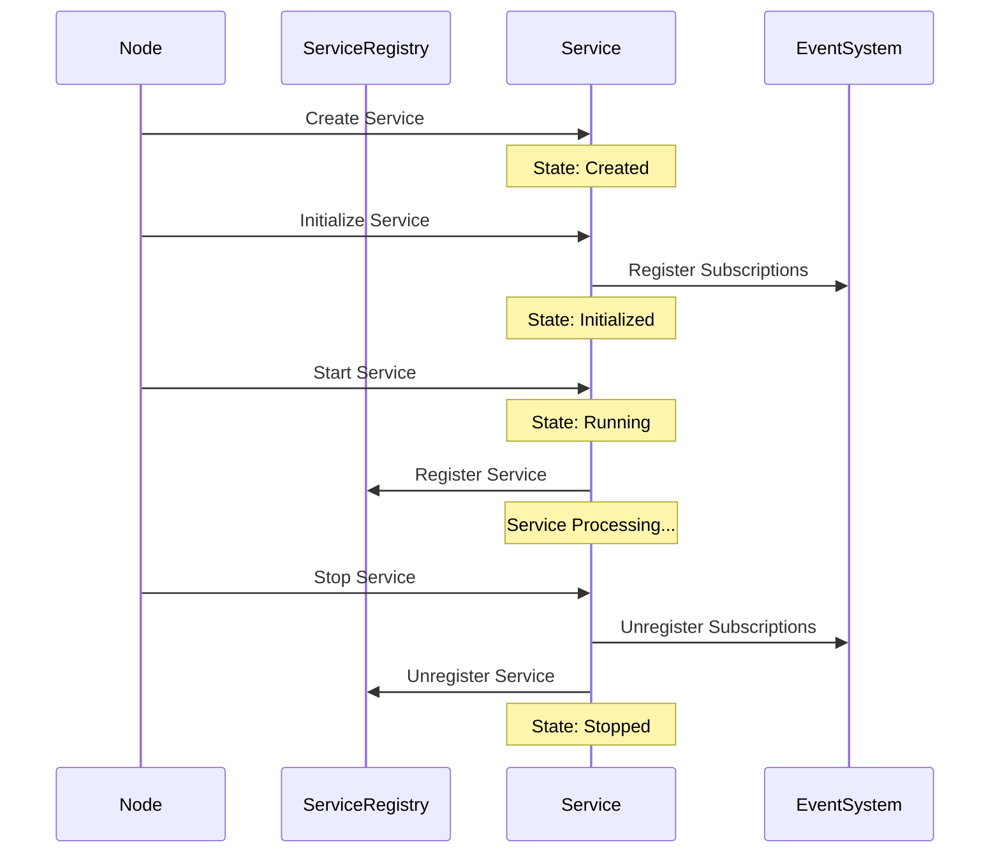
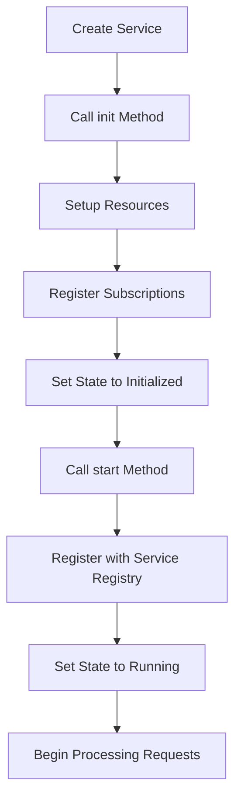
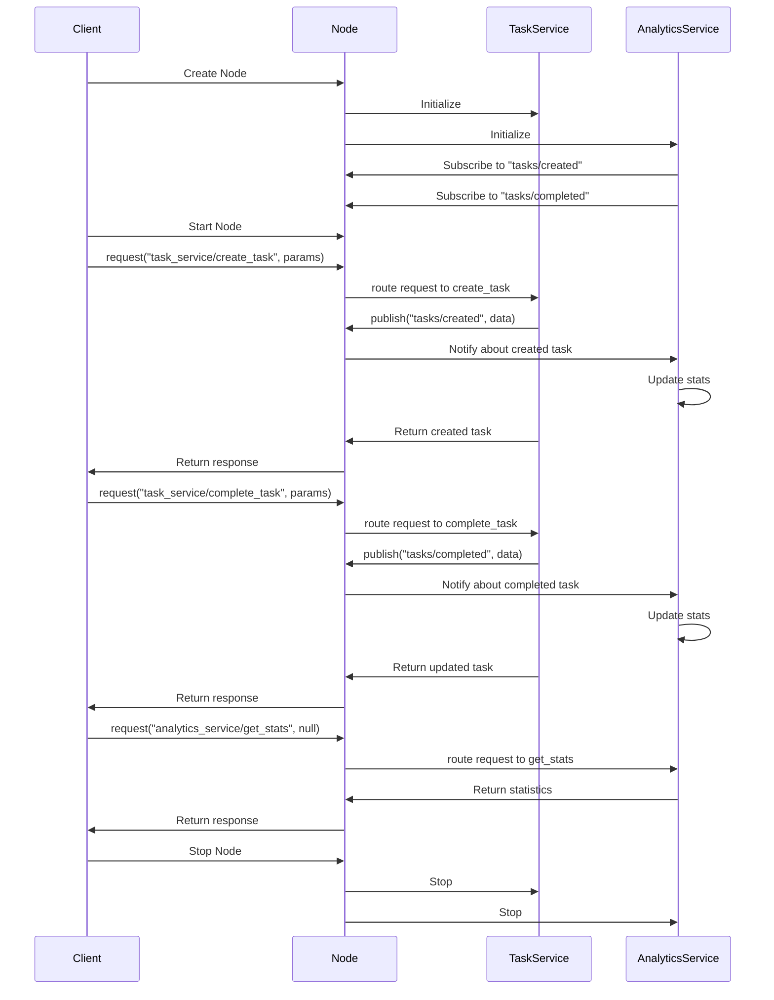

# Runar Node System Architecture

This document describes the high-level architecture of the Runar node system, including core components, data flow patterns, design principles, and implementation guidelines.

## Table of Contents

1. [Introduction](#introduction)
2. [Core Components](#core-components)
   - [Node](#node)
   - [Service Registry](#service-registry)
   - [Abstract Service](#abstract-service)
   - [Request Context](#request-context)
   - [Logging System](#logging-system)
   - [Database System](#database-system)
   - [IPC System](#ipc-system)
3. [Data Flow Patterns](#data-flow-patterns)
   - [Request/Response Pattern](#requestresponse-pattern)
   - [Publish/Subscribe Pattern](#publishsubscribe-pattern)
4. [Design Principles](#design-principles)
   - [Service Organization](#service-organization)
   - [Communication Patterns](#communication-patterns)
   - [Event Handler Lifecycle](#event-handler-lifecycle-management)
   - [Implementation Guidelines](#implementation-guidelines)
   - [Service Implementation Patterns](#service-implementation-patterns)
5. [Service Lifecycle Management](#service-lifecycle-management)
   - [Service Initialization](#service-initialization)
   - [Subscription Management](#subscription-management)
6. [P2P Architecture](#p2p-architecture)
   - [Service Discovery](#service-discovery)
   - [Peer-to-Peer Communication](#peer-to-peer-communication)
   - [Network Configuration](#network-configuration)
7. [Security Considerations](#security-considerations)
   - [Authentication](#authentication)
   - [Authorization](#authorization)
   - [Secure Communication](#secure-communication)
8. [End-to-End Examples](#end-to-end-examples)
   - [Complete Application Example](#complete-application-example)
   - [Proper Architectural Patterns](#proper-architectural-patterns)
   - [Service Communication Flow](#service-communication-flow)

## Introduction

This document provides an overview of the key components and principles governing the system design.

## Core Components

### Node

The central component that manages services and provides core functionality:

- Defined in `node.rs`
- Contains configuration, service management, and network operations
- Acts as the main entry point for the application
- Provides interfaces for service communication and event handling

### Service Registry

Manages service registration, discovery, and communication:

- Defined in `services/registry.rs`
- Maintains a map of registered services
- Routes requests to appropriate services
- Handles publish/subscribe for events
- Manages remote service discovery and communication

### Abstract Service

Base trait implemented by all services:

- Defined in `services/abstract_service.rs`
- Provides unified lifecycle management (init, start, stop)
- Standardizes request processing
- Defines service state transitions
- Provides service metadata through methods:
  - `name()`: Returns the service name
  - `path()`: Returns the service path
  - `description()`: Returns a description of the service
  - `version()`: Returns the service version

### Request Context

Context for service requests:

- Handles path routing and parameter passing
- Provides a uniform interface for service communication
- Enables service-to-service communication
- Manages event subscription and publishing

### Logging System

Component-based logging for debugging and monitoring:

- Defined in `util/logging.rs`
- Categorizes logs by system component
- Supports multiple log levels
- Provides structured logging capabilities

### Database System

SQLite-based storage layer:

- Defined in `db.rs` and `services/sqlite.rs`
- Provides persistence for system data
- Supports CRUD operations and queries
- Manages database connections and transactions

### IPC System

Client-server communication:

- Facilitates communication with external processes
- Implements secure inter-process communication
- Provides APIs for external service integration

## Data Flow Patterns

The Runar node system follows two primary data flow patterns:

### Request/Response Pattern

1. **Client Request**
   - Requests begin in the `RequestContext` with a path and parameters
   - The `NodeRequestHandlerImpl` parses the path into service name and operation
   - Requests are routed to appropriate services through the registry
   - Services process requests and return responses
   - Responses flow back through the handler to the client

2. **Request Routing Flow**
   ```
   Client → Node → ServiceRegistry → TargetService → process_request() → Response
   ```

### Publish/Subscribe Pattern

1. **Event Publication**
   - Publishers emit events to specific topics
   - The service registry manages topic subscriptions
   - Subscribers receive events when published to their topics
   - Events include metadata like timestamps
   - Subscribers process events based on topic and content

2. **Event Flow**
   ```
   Publisher → Node → ServiceRegistry → Topic Subscribers → Event Handlers
   ```

## Design Principles

### Service Organization

- Each functionality should be implemented as a dedicated service
- Services should be self-contained and follow the single responsibility principle
- Avoid conditional routing within services - use dedicated services for different functionalities
- Information services should be separate from their data sources (e.g., `RegistryInfoService` separate from `ServiceRegistry`)
- Use delegation pattern when a service needs to expose data from another component

### Communication Patterns

#### Request/Response

- All service requests must include a `RequestContext`
- Path format should be "serviceName/operation" to enable proper routing
- `NodeRequestHandler` should parse the path to extract service name and operation
- Services should process requests based on the operation field

#### Publish/Subscribe

- Publish operations should mirror request pattern (same path parsing, context handling)
- No response is expected from publish operations
- Event handlers should receive the same context as request handlers
- Context allows event handlers to make additional service calls or trigger events
- Subscribe operations should use the complete path (e.g., "user/created")
- Service name should be extracted from path using the same mechanism as requests
- Each topic should have a clear ownership model (which service owns which topics)

##### Subscription Processing
- When subscribing from within a service, the service name is implied and can be omitted
- When subscribing directly from a Node without a service context, an anonymous service is created
- Anonymous subscribers are registered in the ServiceRegistry with a unique service name
- This ensures all subscribers are tied to a service, maintaining a consistent architecture
- Anonymous services are implemented as fully-functional AbstractService instances

##### Subscription Propagation
- When a node subscribes to a topic, the subscription should be stored in the local registry
- All non-internal services (events and actions) (topics not starting with "internal/") should be propagated to all connected peers
- Internal topics are meant for local node usage only and should not be shared across the network
- This ensures that peers are aware of what topics each node is interested in
- Propagating subscriptions allows nodes to route events across the network efficiently
- When a node receives a remote subscription, it should record it for future event routing

### Event Handler Lifecycle Management

- Event handlers remain active until explicitly unregistered using:
  - `node.unsubscribe(topic, [handler_id])` at the Node level
  - `context.unsubscribe(topic, [handler_id])` from within a RequestContext
- One-time event handlers that auto-unregister after being triggered once:
  - `node.once(topic, callback)` at the Node level
  - `context.once(topic, callback)` from within a RequestContext
- Advanced subscription options via `subscribe_with_options()`:
  - Supports TTL (time-to-live) for automatic cleanup after a specified duration
  - Supports max_triggers to automatically unregister after being triggered N times
  - Supports conditional unsubscribe based on callback return value
- Anonymous services for subscriptions are subject to the following lifecycle:
  - Created when a subscription is registered without a service context
  - Remain active as long as they have at least one active subscription
  - Can be manually unregistered or expire based on subscription options
  - Periodic cleanup removes services with no active subscriptions

### Implementation Guidelines

- Maintain consistent path handling across all communication patterns
- Make service boundaries explicit and well-defined
- Services should expose clear interfaces through their operations
- Prefer composition over inheritance when extending functionality

### Service Implementation Patterns

**Service Operation Delegation:**
- The `process_request` method should match on the operation name and delegate to local methods
- Local method names should match the operation names for clarity and traceability
- Example: `operation "get_data"` should call a local method named `get_data()`
- This improves code organization, readability, and testability
- Complex operation implementations should be moved out of the `process_request` method
- Each operation should have a single, focused implementation method

## Service Lifecycle Management

The following diagram illustrates the lifecycle of a service in the Runar node system:



### Service Initialization

The following diagram illustrates the service initialization flow:



**Subscription Setup:**
- Service subscriptions should be established during the initialization phase (`init` method)
- The `init` method MUST receive a RequestContext parameter to enable subscription registration
- Subscriptions should NEVER be set up in the `process_request` method
- Reasons for this pattern:
  - Ensures subscriptions are set up exactly once when the service starts
  - Prevents redundant subscription setup on every request
  - Maintains clear separation of concerns in the service lifecycle
  - Improves performance by avoiding unnecessary subscription checks
- If a service needs to verify subscriptions are active, use a private method that checks state rather than attempting to re-subscribe
- For dynamic subscriptions that depend on runtime parameters, create dedicated operations for subscription management

**Service Initialization Flow:**
- Services should have a predictable initialization flow: create → init → start
- The `init` method is where all one-time setup like subscriptions should occur
- The `start` method should focus on activating the service's functionality
- Subscriptions registered during `init` should follow the service's lifecycle
- When a service is stopped, its subscriptions should be unregistered

## P2P Architecture

### Service Discovery

The Runar node system implements a comprehensive service discovery mechanism across the P2P network:

- **Service Advertisement**: Services are automatically advertised to connected peers when registered
- **Remote Service Discovery**: Services are discovered when connecting to peers in the P2P network
- **Service Lookup**: The Node provides a `wait_for_service` method to wait for service availability
- **Service Availability**: Services can be local or remote, with transparent access through the service registry
- **Timeout Support**: Service discovery includes timeout mechanisms to prevent indefinite waiting

```rust
// Wait for a service to become available with a 5-second timeout
let service_available = node.wait_for_service("remote_service", Some(5000)).await;
if service_available {
    // Service is ready to use
} else {
    // Handle service unavailable
}
```

### Peer-to-Peer Communication

The P2P layer in Runar nodes implements the following features:

- **Transport Protocol**: QUIC-based transport for reliable, secure, and multiplexed communication
- **Peer Identification**: Peers are identified by a PeerId derived from their public key
- **Network Participation**: Peers can participate in multiple networks with network-specific keys
- **Access Control**: Network access is controlled through cryptographic AccessTokens
- **Message Routing**: Messages are routed to appropriate services across the P2P network
- **Discovery Mechanism**: Peers discover each other using UDP multicast and DHT routing
- **NAT Traversal**: STUN-like server and UDP hole punching for connectivity across NATs

### Network Configuration

P2P functionality in Runar nodes is configured through the Node configuration:

```rust
// Example P2P configuration
let p2p_config = TransportConfig {
    network_id: "network_id".to_string(),
    state_path: "state_path".to_string(),
    bootstrap_nodes: Some(vec!["127.0.0.1:50601".to_string()]),
    listen_addr: Some("127.0.0.1:50602".to_string()),
};

// Create and initialize node with P2P support
let mut node = Node::new(NodeConfig {
    node_id: "my_node".to_string(),
    data_dir: "./data".to_string(),
    db_path: "./data/db".to_string(),
    p2p_config: Some(p2p_config),
}).await?;
```

## Security Considerations

### Authentication

- Services should authenticate requests when necessary
- P2P connections require mutual authentication through AccessTokens
- Authentication should be performed at the service boundary

### Authorization

- Services should implement appropriate authorization checks
- Access to sensitive operations should be restricted
- Access control should be enforced consistently across all services

### Secure Communication

- All P2P communication uses QUIC with TLS for encryption
- Service-to-service communication within a node is memory-safe
- External communication channels should be properly secured

## End-to-End Examples

This section provides complete examples showcasing how the architectural patterns work together in real applications.

### Complete Application Example

Below is a complete example demonstrating proper service implementation, registration, and interaction:

```rust
use runar_macros::{action, service, subscribe};
use runar_node::{
    anyhow::{self, Result},
    async_trait::async_trait,
    node::NodeConfig,
    Node, ValueType, vmap,
};
use serde::{Deserialize, Serialize};
use std::collections::HashMap;
use std::sync::Arc;
use tokio::sync::RwLock;

// Define data types
#[derive(Debug, Clone, Serialize, Deserialize)]
struct Task {
    id: String,
    title: String,
    completed: bool,
}

// Define the task service
#[service(name = "task_service")]
struct TaskService {
    tasks: Arc<RwLock<HashMap<String, Task>>>,
}

// Constructor and methods
impl TaskService {
    fn new() -> Self {
        Self {
            tasks: Arc::new(RwLock::new(HashMap::new())),
        }
    }
    
    // Action handler for creating a task
    #[action(name = "create_task")]
    async fn create_task(&self, context: &RequestContext, title: String) -> Result<Task> {
        let id = uuid::Uuid::new_v4().to_string();
        let task = Task {
            id: id.clone(),
            title,
            completed: false,
        };
        
        // Store the task
        let mut tasks = self.tasks.write().await;
        tasks.insert(id.clone(), task.clone());
        
        // Publish event about task creation
        let event_data = vmap! {
            "task_id" => task.id.clone(),
            "title" => task.title.clone()
        };
        context.publish("tasks/created", event_data).await?;
        
        Ok(task)
    }
    
    // Action handler for completing a task
    #[action(name = "complete_task")]
    async fn complete_task(&self, context: &RequestContext, id: String) -> Result<Task> {
        let mut tasks = self.tasks.write().await;
        let task = tasks.get_mut(&id)
            .ok_or_else(|| anyhow::anyhow!("Task not found"))?;
            
        task.completed = true;
        
        // Publish event about task completion
        let event_data = vmap! {
            "task_id" => task.id.clone()
        };
        context.publish("tasks/completed", event_data).await?;
        
        Ok(task.clone())
    }
    
    // Action handler for listing tasks
    #[action(name = "list_tasks")]
    async fn list_tasks(&self) -> Result<Vec<Task>> {
        let tasks = self.tasks.read().await;
        Ok(tasks.values().cloned().collect())
    }
}

// Define an analytics service
#[service(name = "analytics_service")]
struct AnalyticsService {
    task_counts: Arc<RwLock<HashMap<String, u32>>>,
}

impl AnalyticsService {
    fn new() -> Self {
        Self {
            task_counts: Arc::new(RwLock::new(HashMap::new())),
        }
    }
    
    // Subscribe to task creation events
    #[subscribe(topic = "tasks/created")]
    async fn on_task_created(&mut self, payload: ValueType) -> Result<()> {
        let task_id = vmap_str!(payload, "task_id" => "");
        let title = vmap_str!(payload, "title" => "");
        
        println!("Analytics: New task created: {} - {}", task_id, title);
        
        // Update statistics
        let mut counts = self.task_counts.write().await;
        *counts.entry("created".to_string()).or_insert(0) += 1;
        
        Ok(())
    }
    
    // Subscribe to task completion events
    #[subscribe(topic = "tasks/completed")]
    async fn on_task_completed(&mut self, payload: ValueType) -> Result<()> {
        let task_id = vmap_str!(payload, "task_id" => "");
        
        println!("Analytics: Task completed: {}", task_id);
        
        // Update statistics
        let mut counts = self.task_counts.write().await;
        *counts.entry("completed".to_string()).or_insert(0) += 1;
        
        Ok(())
    }
    
    // Action handler for getting task statistics
    #[action(name = "get_stats")]
    async fn get_stats(&self) -> Result<HashMap<String, u32>> {
        let counts = self.task_counts.read().await;
        Ok(counts.clone())
    }
}

// Main application
#[tokio::main]
async fn main() -> Result<()> {
    // 1. Create node with configuration
    let config = NodeConfig::default()
        .with_name("task_manager")
        .with_description("Task Management Application");
        
    let mut node = Node::new(config).await?;
    
    // 2. Initialize node
    node.init().await?;
    
    // 3. Create services
    let task_service = TaskService::new();
    let analytics_service = AnalyticsService::new();
    
    // 4. Register services with the node using the proper add_service method
    node.add_service(task_service).await?;
    node.add_service(analytics_service).await?;
    
    // 5. Start the node to activate all services
    node.start().await?;
    
    // 6. Use services through the request-based API
    
    // Create a new task
    let create_params = vmap! {
        "title" => "Learn Runar Architecture"
    };
    let create_result = node.request("task_service/create_task", create_params).await?;
    
    // Extract task ID using vmap! for clean extraction with defaults
    let task_id = vmap_str!(create_result.data, "id" => "");
    println!("Created task with ID: {}", task_id);
    
    // Complete the task
    let complete_params = vmap! {
        "id" => task_id
    };
    let complete_result = node.request("task_service/complete_task", complete_params).await?;
    println!("Task completed: {:?}", complete_result);
    
    // List all tasks
    let list_result = node.request("task_service/list_tasks", ValueType::Null).await?;
    println!("All tasks: {:?}", list_result);
    
    // Get analytics stats
    let stats_result = node.request("analytics_service/get_stats", ValueType::Null).await?;
    println!("Task statistics: {:?}", stats_result);
    
    // 7. Clean shutdown
    node.stop().await?;
    
    Ok(())
}
```

### Proper Architectural Patterns

This example demonstrates all the critical architectural patterns:

1. **Service Definition**: Services are defined with clear responsibilities (TaskService, AnalyticsService)
2. **Service Registration**: Using `node.add_service()` to properly register services
3. **Request-based API**: Using `node.request()` for all service interactions
4. **Event-driven Communication**: Services communicate via events for loose coupling
5. **Clean Parameter Extraction**: Using specialized vmap macros (`vmap_str!`, `vmap_i32!`, etc.) for safe extraction with defaults
6. **Proper Lifecycle Management**: Following create → init → start → use → stop

### Service Communication Flow

The sequence diagram below illustrates the complete communication flow in our example:



This comprehensive example demonstrates how all the architectural elements work together in a cohesive application, following the recommended patterns and guidelines.

## Example Implementations

### TaskService Implementation

```rust
use anyhow::Result;
use async_trait::async_trait;
use chrono::Utc;
use runar_node::{
    Node, ValueType, vmap,
    services::{
        AbstractService, RequestContext, ResponseStatus, 
        ServiceRequest, ServiceResponse, ServiceState
    }
};
use std::collections::HashMap;
use std::sync::Arc;
use tokio::sync::Mutex;
use uuid::Uuid;

struct Task {
    id: String,
    title: String,
    description: String,
    completed: bool,
    created_at: String,
    updated_at: String,
}

impl Task {
    fn new(title: &str, description: &str) -> Self {
        let now = Utc::now().to_rfc3339();
        Self {
            id: Uuid::new_v4().to_string(),
            title: title.to_string(),
            description: description.to_string(),
            completed: false,
            created_at: now.clone(),
            updated_at: now,
        }
    }
    
    fn mark_complete(&mut self) {
        self.completed = true;
        self.updated_at = Utc::now().to_rfc3339();
    }
    
    fn to_value_type(&self) -> ValueType {
        let event_data = vmap! {
            "id" => self.id.clone(),
            "title" => self.title.clone(),
            "description" => self.description.clone(),
            "completed" => self.completed,
            "created_at" => self.created_at.clone(),
            "updated_at" => self.updated_at.clone()
        };
        event_data
    }
}

struct TaskService {
    name: String,
    path: String,
    state: ServiceState,
    tasks: Arc<Mutex<HashMap<String, Task>>>,
}

impl TaskService {
    fn new(name: &str) -> Self {
        Self {
            name: name.to_string(),
            path: name.to_string(),
            state: ServiceState::Created,
            tasks: Arc::new(Mutex::new(HashMap::new())),
        }
    }
    
    async fn handle_create(&self, request: &ServiceRequest, context: &RequestContext) -> Result<ServiceResponse> {
        // Extract parameters using vmap! with proper defaults
        let title = vmap_str!(request.params, "title" => "");
        let description = vmap_str!(request.params, "description" => "");
        
        // Create a new task
        let task = Task::new(&title, &description);
        let task_id = task.id.clone();
        
        // Store the task
        {
            let mut tasks = self.tasks.lock().await;
            tasks.insert(task_id.clone(), task.clone());
        }
        
        // Publish task created event
        let event_data = vmap! {
            "task_id" => task_id.clone(),
            "title" => title
        };
        
        context.publish(&format!("{}/task_created", self.path), event_data).await?;
        
        // Return the task ID
        Ok(ServiceResponse {
            status: ResponseStatus::Success,
            message: "Task created successfully".to_string(),
            data: Some(vmap! {
                "id" => task_id
            }),
        })
    }
    
    async fn handle_complete(&self, request: &ServiceRequest, context: &RequestContext) -> Result<ServiceResponse> {
        // Extract task ID using vmap! with default value
        let task_id = vmap_str!(request.params, "task_id" => "");
        
        let mut task_found = false;
        
        // Mark the task as complete
        {
            let mut tasks = self.tasks.lock().await;
            if let Some(task) = tasks.get_mut(&task_id) {
                task.mark_complete();
                task_found = true;
            }
        }
        
        if task_found {
            // Publish task completed event
            let event_data = vmap! {
                "task_id" => task_id
            };
            
            context.publish(&format!("{}/task_completed", self.path), event_data).await?;
            
            // Return success response
            Ok(ServiceResponse {
                status: ResponseStatus::Success,
                message: "Task marked as complete".to_string(),
                data: None,
            })
        } else {
            // Return error response
            Ok(ServiceResponse {
                status: ResponseStatus::Error,
                message: format!("Task with ID {} not found", task_id),
                data: None,
            })
        }
    }
}

#[async_trait]
impl AbstractService for TaskService {
    fn name(&self) -> &str {
        &self.name
    }
    
    fn path(&self) -> &str {
        &self.path
    }
    
    fn state(&self) -> ServiceState {
        self.state
    }
    
    fn description(&self) -> &str {
        "Service for managing tasks"
    }
    
    fn version(&self) -> &str {
        "1.0.0"
    }
    
    async fn init(&mut self, _context: &RequestContext) -> Result<()> {
        self.state = ServiceState::Initialized;
        Ok(())
    }
    
    async fn start(&mut self) -> Result<()> {
        self.state = ServiceState::Running;
        Ok(())
    }
    
    async fn stop(&mut self) -> Result<()> {
        self.state = ServiceState::Stopped;
        Ok(())
    }
    
    async fn handle_request(&self, request: ServiceRequest) -> Result<ServiceResponse> {
        match request.operation.as_str() {
            "create" => self.handle_create(&request, &request.request_context).await,
            "complete" => self.handle_complete(&request, &request.request_context).await,
            _ => Ok(ServiceResponse {
                status: ResponseStatus::Error,
                message: format!("Unknown operation: {}", request.operation),
                data: None,
            }),
        }
    }
}
```

### TaskMonitorService Implementation

```rust
struct TaskMonitorService {
    name: String,
    path: String,
    state: ServiceState,
    task_counts: Arc<Mutex<HashMap<String, usize>>>,
}

impl TaskMonitorService {
    fn new(name: &str) -> Self {
        let mut counts = HashMap::new();
        counts.insert("created".to_string(), 0);
        counts.insert("completed".to_string(), 0);
        
        Self {
            name: name.to_string(),
            path: name.to_string(),
            state: ServiceState::Created,
            task_counts: Arc::new(Mutex::new(counts)),
        }
    }
    
    async fn on_task_created(&self, payload: ValueType) -> Result<()> {
        // Extract task ID using vmap! with default value
        let task_id = vmap_str!(payload, "task_id" => "");
        let title = vmap_str!(payload, "title" => "");
        
        // Update counts
        {
            let mut counts = self.task_counts.lock().await;
            *counts.entry("created".to_string()).or_insert(0) += 1;
        }
        
        println!("TaskMonitorService: New task created - ID: {}, Title: {}", task_id, title);
        Ok(())
    }
    
    async fn on_task_completed(&self, payload: ValueType) -> Result<()> {
        // Extract task ID using vmap! with default value
        let task_id = vmap_str!(payload, "task_id" => "");
        
        // Update counts
        {
            let mut counts = self.task_counts.lock().await;
            *counts.entry("completed".to_string()).or_insert(0) += 1;
        }
        
        println!("TaskMonitorService: Task completed - ID: {}", task_id);
        Ok(())
    }
}

#[async_trait]
impl AbstractService for TaskMonitorService {
    // ... other trait methods as shown above ...
    
    async fn init(&mut self, context: &RequestContext) -> Result<()> {
        // Subscribe to task events
        context.subscribe("task_service/task_created", move |payload| {
            let this = self.clone();
            Box::pin(async move {
                this.on_task_created(payload).await
            })
        }).await?;
        
        context.subscribe("task_service/task_completed", move |payload| {
            let this = self.clone();
            Box::pin(async move {
                this.on_task_completed(payload).await
            })
        }).await?;
        
        self.state = ServiceState::Initialized;
        Ok(())
    }
    
    // ... other trait methods as shown above ...
}
```

### Usage Example

```rust
#[tokio::main]
async fn main() -> Result<()> {
    // Create a node
    let mut node = Node::new(/* config */);
    
    // Add services
    let task_service = TaskService::new("task_service");
    let monitor_service = TaskMonitorService::new("task_monitor");
    
    node.add_service(task_service).await?;
    node.add_service(monitor_service).await?;
    
    // Start the node
    node.start().await?;
    
    // Create a task
    let create_params = vmap! {
        "title" => "Implement architecture",
        "description" => "Create a clean, modular architecture"
    };
    
    let create_result = node.request("task_service/create", create_params).await?;
    
    // Extract task ID using vmap! for clean extraction with defaults
    let task_id = vmap_str!(create_result.data, "id" => "");
    
    // Complete the task
    let complete_params = vmap! {
        "task_id" => task_id
    };
    
    node.request("task_service/complete", complete_params).await?;
    
    // Node shutdown will happen automatically when it goes out of scope
    Ok(())
}
```

## Key Architecture Features

1. **Service Boundaries**: Tasks and monitoring are separate services
2. **Event-Driven Communication**: Services communicate via events
3. **Request-Response Pattern**: Task operations use request-response
4. **Clean Module Organization**: Each component has a clear responsibility 
5. **Clean Parameter Extraction**: Using specialized vmap macros (`vmap_str!`, `vmap_i32!`, etc.) for safe extraction with defaults
