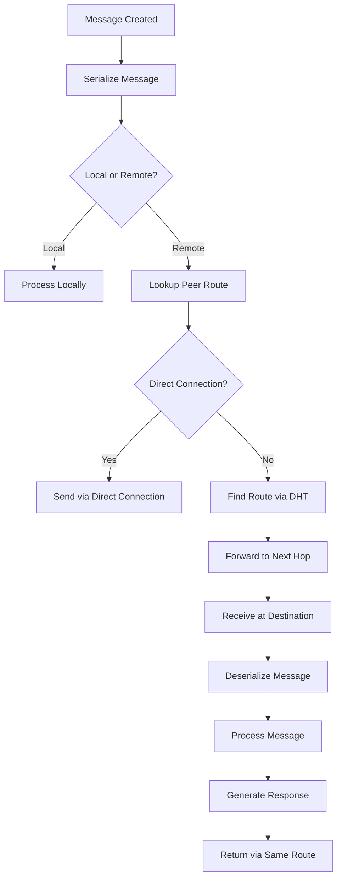
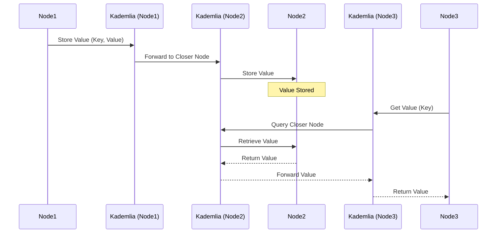
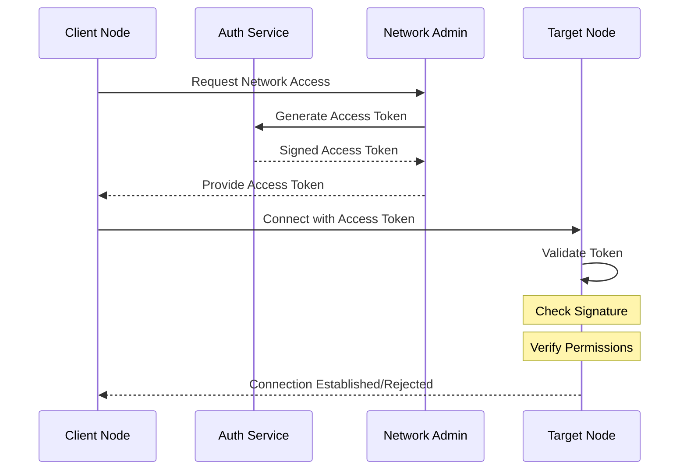
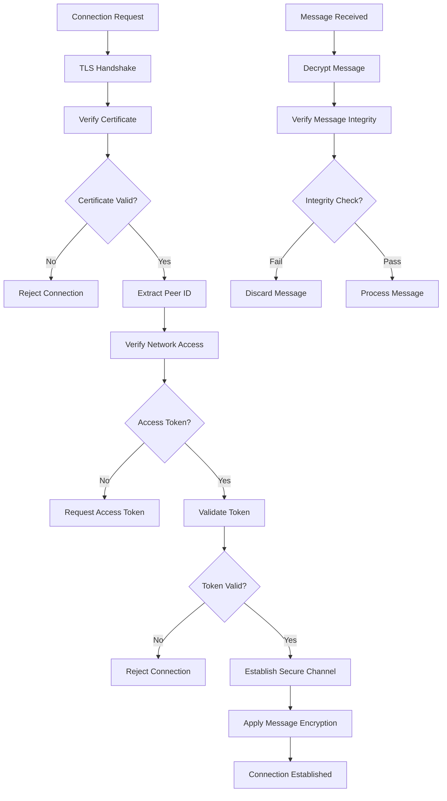

# P2P Transport Layer Specification

This specification defines a peer-to-peer (P2P) transport layer implemented in Rust, designed as an event bus using QUIC as the transport protocol. It supports network-specific participation, decentralized storage via a Kademlia Distributed Hash Table (DHT), and secure access control through cryptographic tokens.

## Table of Contents

1. [Overview](#overview)
2. [Core Components](#core-components)
   - [Transport Layer](#transport-layer)
   - [DHT System](#dht-system)
   - [Network Management](#network-management)
3. [API Design](#api-design)
   - [Message Operations](#message-operations)
   - [Network Operations](#network-operations)
   - [DHT Operations](#dht-operations)
4. [Security](#security)
   - [Access Control](#access-control)
   - [Connection Security](#connection-security)
5. [Implementation Details](#implementation-details)
   - [Transport Implementation](#transport-implementation)
   - [DHT Implementation](#dht-implementation)
6. [Integration](#integration)
   - [Service Integration](#service-integration)

   - [Discovery Integration](#discovery-integration)

## Overview

The P2P transport layer provides:
- QUIC-based reliable transport
- Network-scoped DHT for decentralized storage
- Secure peer authentication and authorization
- Integration with the Runar node service architecture
- Event-based message routing and delivery

## Core Components

### Transport Layer

**Requirements**:
- Reliable message delivery using QUIC
- Support for Rust object serialization
- Peer-to-peer and broadcast messaging
- Connection multiplexing
- Flow control and backpressure

**Features**:
- Asynchronous message handling
- Automatic reconnection
- Connection pooling
- Quality of service options
- Error recovery

The following diagram illustrates the P2P message routing flow:



### DHT System

**Features**:
- Kademlia-based routing
- Network-scoped key-value storage
- Replication and redundancy
- Automatic peer discovery
- Value expiration and refresh

### Network Management

**Features**:
- Network-specific participation
- Access token validation
- Peer authentication
- Connection management
- Network metadata

## API Design

### Message Operations

```rust
/// Send a message to a specific peer
async fn send_to_peer<T: Serialize>(
    &self,
    peer_id: PeerId,
    message: T
) -> Result<(), Error>;

/// Broadcast a message to multiple peers
async fn broadcast<T: Serialize>(
    &self,
    peer_ids: &[PeerId],
    message: T
) -> Result<(), Error>;

/// Start listening for incoming messages
fn start_listening(&self) -> mpsc::Receiver<(PeerId, Vec<u8>)>;
```

### Network Operations

```rust
/// Configure network metadata
async fn set_network_metadata(
    &self,
    network_id: NetworkId,
    admin_pubkey: PublicKey,
    name: String
) -> Result<(), Error>;

/// Add network access token
async fn add_network_token(
    &self,
    network_id: NetworkId,
    token: AccessToken
) -> Result<(), Error>;

/// Connect to a peer in a specific network
async fn connect_to_peer(
    &self,
    peer_id: PeerId,
    network_id: NetworkId,
    address: String
) -> Result<Connection, Error>;
```

### DHT Operations

The following diagram illustrates the DHT operations in the P2P network:



```rust
/// Store a value in the DHT
async fn dht_put(
    &self,
    network_id: NetworkId,
    key: Vec<u8>,
    value: Vec<u8>
) -> Result<(), Error>;

/// Retrieve a value from the DHT
async fn dht_get(
    &self,
    network_id: NetworkId,
    key: Vec<u8>
) -> Result<Option<Vec<u8>>, Error>;

/// Bootstrap the DHT using a known peer
async fn bootstrap(
    &self,
    network_id: NetworkId,
    bootstrap_peer: PeerId
) -> Result<(), Error>;
```

## Security

The following diagram illustrates the network authentication process:



The following flow diagram illustrates the security flow in the P2P network:



### Access Control

**Token Validation**:
```rust
impl P2PTransport {
    async fn validate_peer_token(
        &self,
        peer_id: &PeerId,
        network_id: &NetworkId,
        token: &AccessToken
    ) -> Result<bool, Error> {
        // Verify token signature using network's public key
        if !token.verify(network_id)? {
            return Ok(false);
        }
        
        // Check token belongs to the peer
        if token.peer_id != *peer_id {
            return Ok(false);
        }
        
        // Check expiration
        if token.is_expired() {
            return Ok(false);
        }
        
        Ok(true)
    }
}
```

### Connection Security

**QUIC Configuration**:
```rust
impl P2PTransport {
    fn configure_quic(&self) -> QuicConfig {
        QuicConfig::new()
            .with_max_idle_timeout(Duration::from_secs(30))
            .with_max_concurrent_bidi_streams(100u32)
            .with_max_concurrent_uni_streams(100u32)
            .with_application_protocols(vec!["runar-p2p-1".into()])
    }
}
```

## Implementation Details

### Transport Implementation

**Connection Management**:
```rust
pub struct P2PTransport {
    endpoint: QuicEndpoint,
    connections: Arc<RwLock<HashMap<PeerId, Connection>>>,
    networks: Arc<RwLock<HashMap<NetworkId, NetworkState>>>,
    message_tx: mpsc::Sender<(PeerId, Vec<u8>)>,
    message_rx: mpsc::Receiver<(PeerId, Vec<u8>)>,
}

impl P2PTransport {
    async fn handle_connection(&self, conn: Connection) {
        while let Ok(stream) = conn.accept_bi().await {
            let (mut send, mut recv) = stream;
            
            // Handle incoming messages
            while let Some(message) = recv.next().await {
                self.process_message(message).await?;
            }
        }
    }
}
```

### DHT Implementation

**Kademlia Integration**:
```rust
pub struct DHTNode {
    routing_table: RoutingTable,
    storage: Arc<RwLock<HashMap<Vec<u8>, Vec<u8>>>>,
    network_id: NetworkId,
}

impl DHTNode {
    async fn handle_find_value(
        &self,
        key: Vec<u8>
    ) -> Result<Option<Vec<u8>>, Error> {
        // Check local storage first
        if let Some(value) = self.storage.read().await.get(&key) {
            return Ok(Some(value.clone()));
        }
        
        // Query closest peers
        let closest = self.routing_table.closest_peers(&key);
        for peer in closest {
            if let Some(value) = self.query_peer(peer, key.clone()).await? {
                return Ok(Some(value));
            }
        }
        
        Ok(None)
    }
}
```

## Integration

### Service Integration

The P2P transport integrates with Runar services through the service registry:

```rust
impl P2PTransport {
    async fn forward_to_service(
        &self,
        service: &str,
        request: ServiceRequest
    ) -> Result<ServiceResponse, Error> {
        let service = self.registry.get_service(service)?;
        service.process_request(request).await
    }
}
```


### Discovery Integration

Integration with the Discovery mechanism:

```rust
impl P2PTransport {
    async fn handle_discovery_event(
        &self,
        event: DiscoveryEvent
    ) -> Result<(), Error> {
        match event {
            DiscoveryEvent::PeerFound { peer_id, addr, networks } => {
                for network_id in networks {
                    if self.is_network_member(&network_id) {
                        self.connect_to_peer(peer_id, network_id, addr.clone()).await?;
                    }
                }
            }
            DiscoveryEvent::PeerLost { peer_id } => {
                self.remove_peer(peer_id).await?;
            }
        }
        Ok(())
    }
}
```

This specification aligns with:
- Keys Management Specification for PeerId and NetworkId definitions
- Discovery Mechanism Specification for peer discovery

- Service Architecture for message routing and processing


## Examples

This section will be expanded with practical examples.
