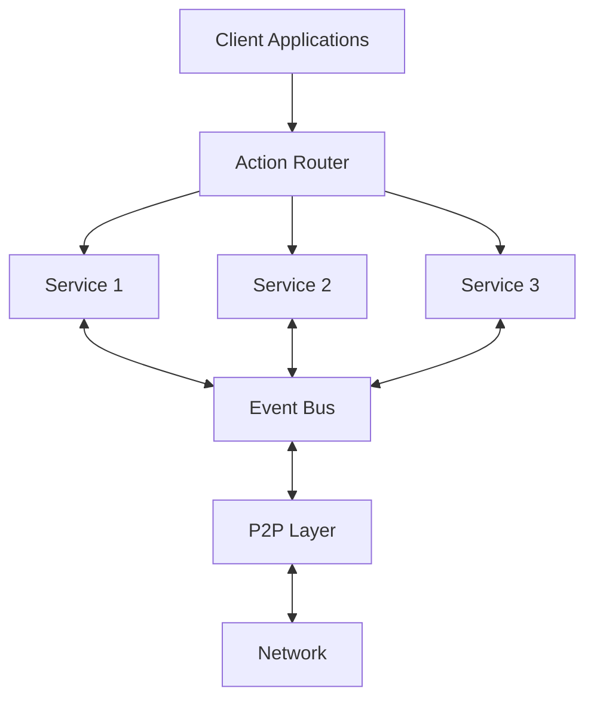

# Runar Overview

## Introduction

Runar is a powerful distributed system framework built in Rust. It provides a declarative, approach to defining services, actions, and event subscriptions for building resilient peer-to-peer or distributed microservices applications.

## Key Features

- **Distributed Architecture**: Fully distributed with no central points of failure
- **End-to-End Encryption**: Secure communication between nodes
- **Declarative API**: Easy-to-use macros for defining services and handlers
- **Event-Based Communication**: Publish-subscribe pattern for system events
- **Fault Tolerance**: Resilient to network failures and node crashes
- **Extensible**: Easy to add new services and functionality

## Core Components

Runar consists of several core components:

1. **Node**: The main runtime that hosts services and manages communication
2. **Services**: Independent modules that provide specific functionality
3. **Actions**: Request handlers that process incoming service requests
4. **Events**: Asynchronous messages for inter-service communication
5. **Discovery**: Mechanism for finding other nodes in the network
6. **P2P Layer**: Peer-to-peer communication layer

## Architecture Overview

The following diagram illustrates the high-level architecture of a Runar node:



## Service Model

Services in Runar are defined using a declarative approach with macros:

```rust
use anyhow::Result;
use runar_macros::{action, service, subscribe};
use runar_node::services::{RequestContext, EventContext};
use runar_common::types::ArcValue; // Assuming ArcValue might be used

#[service(name = "example_service", path = "example")]
struct ExampleService {
    // Service state can be initialized in new()
}

#[service_impl]
impl ExampleService {
    // Constructor following the pattern
    pub fn new() -> Self {
        // Initialize service state here
        Self { }
    }

    #[action(name = "perform_task")]
    async fn perform_task(&self, ctx: &RequestContext, input: String) -> Result<String> {
        // Handler implementation
        // Example: Log input and return a response
        ctx.info(format!("perform_task called with input: {}", input));
        Ok(format!("Task completed with input: {}", input))
    }
    
    #[subscribe(topic = "event/type")]
    async fn handle_event(&self, ctx: &EventContext, data: Option<ArcValue>) -> Result<()> {
        // Event handler implementation
        // Example: Log event data
        if let Some(event_data) = data {
            ctx.info(format!("handle_event received data: {:?}", event_data));
        } else {
            ctx.info("handle_event received no data".to_string());
        }
        Ok(())
    }
}
```

## Next Steps

- [Installation Guide](installation) - Install Runar and its dependencies
- [Quick Start Guide](quickstart) - Build your first Runar application
- [Architecture](../core/architecture) - Detailed architecture documentation