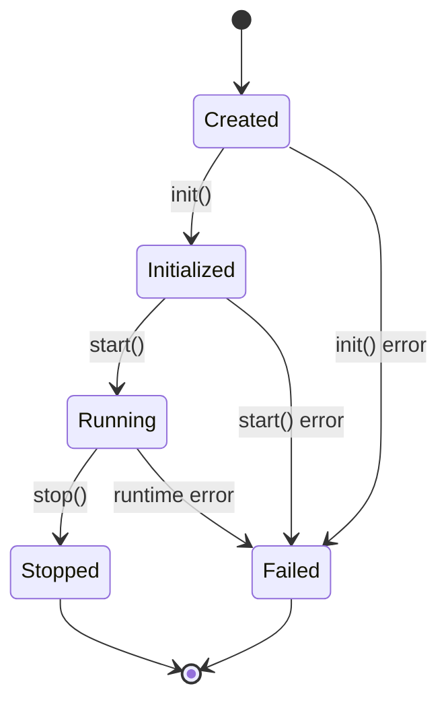

# Service Lifecycle

## Overview

This document outlines the lifecycle of services in Runar, focusing on proper initialization, operation, and shutdown. Following these lifecycle best practices ensures reliable service behavior, efficient resource usage, and predictable interactions between services.

## Service States

A Runar service transitions through several states during its lifecycle:

1. **Created**: Initial state when a service instance is constructed
2. **Initialized**: Service has completed its initialization and is ready to start
3. **Running**: Service is actively processing requests
4. **Stopped**: Service has been gracefully stopped
5. **Failed**: Service encountered an error during its lifecycle



## Lifecycle Methods

### Constructor

The constructor creates a new service instance with minimal setup:

```rust
fn new(name: &str) -> Self {
    Self {
        name: name.to_string(),
        path: name.to_string(),
        state: Mutex::new(ServiceState::Created),
        // Initialize other fields
    }
}
```

**Best Practices**:
- Keep constructors lightweight
- Only initialize fields that don't depend on context
- Don't perform I/O operations or network calls
- Don't acquire locks or resources

### init

The `init` method performs all necessary initialization before the service can start running:

```rust
async fn init(&mut self, context: &RequestContext) -> Result<()> {
    info!("Initializing service", context);
    
    // Set up subscriptions during initialization
    self.setup_subscriptions(context).await?;
    
    // Initialize resources
    self.connect_to_database(context).await?;
    
    // Update service state
    *self.state.lock().await = ServiceState::Initialized;
    
    Ok(())
}
```

**Best Practices**:
- Always set up subscriptions in the `init` method, not during request handling
- Initialize all resources needed by the service
- Update the service state to `Initialized` at the end of successful initialization
- Log initialization steps for debugging
- Handle errors appropriately

### start

The `start` method transitions the service from `Initialized` to `Running`:

```rust
async fn start(&mut self) -> Result<()> {
    info!("Starting service", context = None);
    
    // Start any background tasks
    self.start_background_workers().await?;
    
    // Update service state
    *self.state.lock().await = ServiceState::Running;
    
    Ok(())
}
```

**Best Practices**:
- Only start background tasks or workers in this method
- Keep the method quick and focused
- Don't perform long-running operations
- Update the service state to `Running` at the end

### stop

The `stop` method gracefully stops the service:

```rust
async fn stop(&mut self) -> Result<()> {
    info!("Stopping service", context = None);
    
    // Stop any background tasks
    self.stop_background_workers().await?;
    
    // Release resources
    self.close_database_connections().await?;
    
    // Update service state
    *self.state.lock().await = ServiceState::Stopped;
    
    Ok(())
}
```

**Best Practices**:
- Clean up all resources acquired during initialization
- Stop all background tasks
- Close connections
- Wait for tasks to complete when appropriate
- Update the service state to `Stopped` at the end

## Subscription Setup

### Best Practice: Setup During Initialization

Subscriptions should always be set up during the service's `init` method:

```rust
async fn init(&mut self, context: &RequestContext) -> Result<()> {
    info!("Initializing MyService", context);
    
    // Set up subscriptions during initialization
    self.setup_subscriptions(context).await?;
    
    // Update service state
    *self.state.lock().await = ServiceState::Initialized;
    
    Ok(())
}

async fn setup_subscriptions(&self, context: &RequestContext) -> Result<()> {
    // Set up all required subscriptions
    context.subscribe("topic/one", |payload| { /* handler */ }).await?;
    context.subscribe("topic/two", |payload| { /* handler */ }).await?;
    
    Ok(())
}
```

**Benefits of this approach**:
1. Cleaner, more predictable service lifecycle
2. Better performance (no lock overhead during request handling)
3. Subscriptions are guaranteed to be set up before any requests are processed
4. Avoids potential race conditions and duplicate subscriptions
5. Makes the service's dependencies and requirements clear

### Anti-Pattern: Subscription Setup During Request Handling

Never set up or validate subscriptions during request handling:

```rust
// ANTI-PATTERN: Don't do this
async fn handle_request(&self, request: ServiceRequest) -> Result<ServiceResponse> {
    // Bad practice: Setting up or checking subscriptions during request handling
    self.ensure_subscriptions(&request.request_context).await?;
    
    // Rest of request handling...
}
```

**Why this is problematic**:
1. Adds unnecessary overhead to every request
2. Creates potential thread contention on the lock
3. Violates the principle that initialization should happen during service init
4. Could lead to race conditions or duplicate subscriptions
5. Makes the service behavior less predictable

## Event Handlers

When setting up event handlers in the `setup_subscriptions` method, follow these best practices:

1. **Clone the service for closures**:
   ```rust
   let self_clone = Arc::new(self.clone());
   ```

2. **Use specific clones for each handler**:
   ```rust
   let self_valid = self_clone.clone();
   ```

3. **Process events asynchronously**:
   ```rust
   tokio::spawn(async move {
       self_valid.handle_valid_event(json_value).await;
   });
   ```

4. **Handle different payload formats**:
   ```rust
   if let ValueType::Json(json_value) = payload {
       // Handle JSON
   } else if let ValueType::Map(map_value) = payload {
       // Handle Map
   } else {
       // Handle other formats
   }
   ```

5. **Log event handling**:
   ```rust
   debug!("Received event on topic", 
       "topic" => topic,
       "payload_type" => format!("{:?}", payload)
   );
   ```

## Lifecycle Context

For initialization that depends on the service's lifecycle, use the `LifecycleContext`:

```rust
fn with_lifecycle_context<F, R>(&self, f: F) -> R
where
    F: FnOnce(&LifecycleContext) -> R,
{
    let context = LifecycleContext::new(self.name(), self.path());
    f(&context)
}
```

This provides a context for operations that occur during the service lifecycle but outside of request handling.

## Common Anti-Patterns

### 1. Late Initialization

**Anti-Pattern**: Deferring initialization tasks until a request arrives:

```rust
// ANTI-PATTERN: Late initialization in request handling
async fn handle_request(&self, request: ServiceRequest) -> Result<ServiceResponse> {
    if self.database.lock().await.is_none() {
        self.initialize_database().await?;
    }
    // ...
}
```

**Best Practice**: Initialize everything in the `init` method:

```rust
async fn init(&mut self, context: &RequestContext) -> Result<()> {
    self.initialize_database().await?;
    // ...
}
```

### 2. Subscription Validation During Request Handling

**Anti-Pattern**: Checking if subscriptions are set up during request handling:

```rust
// ANTI-PATTERN: Don't do this
async fn ensure_subscriptions(&self, context: &RequestContext) -> Result<()> {
    let setup = self.subscriptions_setup.lock().await;
    if !*setup {
        drop(setup); // Release the lock before calling setup_subscriptions
        self.setup_subscriptions(context).await?;
    }
    Ok(())
}
```

**Best Practice**: Set up all subscriptions during initialization and avoid any checks during request handling.

### 3. State Mutation During Request Handling

**Anti-Pattern**: Changing the service state during request handling:

```rust
// ANTI-PATTERN: Don't change service state during request handling
async fn handle_request(&self, request: ServiceRequest) -> Result<ServiceResponse> {
    *self.state.lock().await = ServiceState::Running; // Bad practice
    // ...
}
```

**Best Practice**: Only change service state in lifecycle methods (`init`, `start`, `stop`).

## Related Documentation

- Context System - How to use the context system effectively
- Request Handling - Best practices for handling service requests
- Logging System - Context-aware logging practices 