# Runar Node System Diagrams

This document provides a comprehensive collection of system diagrams illustrating the various flows and interactions within the Runar node system.

## Table of Contents
1. [Sequence Diagrams](#sequence-diagrams)
   - [Local Service Request](#local-service-request)
   - [Remote Service Request](#remote-service-request)
   - [P2P Discovery and Connection](#p2p-discovery-and-connection)
   - [Event Publication](#event-publication)
   - [Service Subscription Setup](#service-subscription-setup)
   - [DHT Operations](#dht-operations)
   - [Service Lifecycle](#service-lifecycle)
   - [Network Authentication](#network-authentication)
2. [Flow Diagrams](#flow-diagrams)
   - [Request Processing](#request-processing)
   - [Service Initialization](#service-initialization)
   - [P2P Message Routing](#p2p-message-routing)
   - [Cache Operations](#cache-operations)
   - [Event Distribution](#event-distribution)
   - [Discovery Process](#discovery-process)
   - [Security Flow](#security-flow)
   - [Service Communication](#service-communication)

## Sequence Diagrams

### Local Service Request
Shows the flow of a request to a local service.

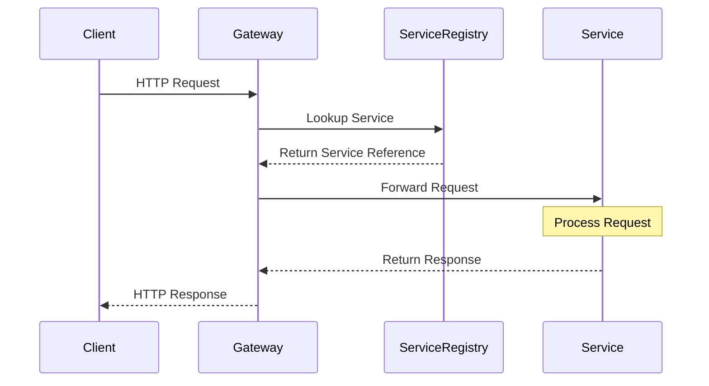
```mermaid
sequenceDiagram
    participant C as Client
    participant G as Gateway
    participant SR as ServiceRegistry
    participant S as Service

    C->>G: HTTP Request
    G->>SR: Lookup Service
    SR-->>G: Return Service Reference
    G->>S: Forward Request
    Note over S: Process Request
    S-->>G: Return Response
    G-->>C: HTTP Response
```

### Remote Service Request
Illustrates how requests are handled when the target service is on a remote peer.

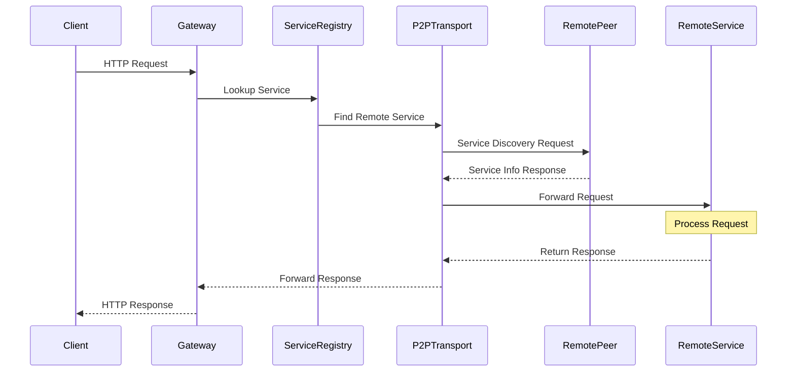
```mermaid
sequenceDiagram
    participant C as Client
    participant G as Gateway
    participant SR as ServiceRegistry
    participant P2P as P2PTransport
    participant RP as RemotePeer
    participant RS as RemoteService

    C->>G: HTTP Request
    G->>SR: Lookup Service
    SR->>P2P: Find Remote Service
    P2P->>RP: Service Discovery Request
    RP-->>P2P: Service Info Response
    P2P->>RS: Forward Request
    Note over RS: Process Request
    RS-->>P2P: Return Response
    P2P-->>G: Forward Response
    G-->>C: HTTP Response
```

### P2P Discovery and Connection
Shows how peers discover and establish connections with each other.

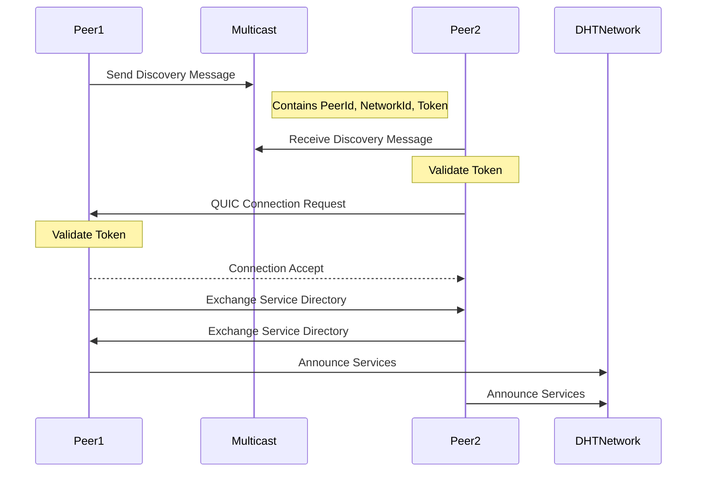
```mermaid
sequenceDiagram
    participant P1 as Peer1
    participant M as Multicast
    participant P2 as Peer2
    participant DHT as DHTNetwork

    P1->>M: Send Discovery Message
    Note right of M: Contains PeerId, NetworkId, Token
    P2->>M: Receive Discovery Message
    Note over P2: Validate Token
    P2->>P1: QUIC Connection Request
    Note over P1: Validate Token
    P1-->>P2: Connection Accept
    P1->>P2: Exchange Service Directory
    P2->>P1: Exchange Service Directory
    P1->>DHT: Announce Services
    P2->>DHT: Announce Services
```

### Event Publication
Demonstrates how events are published and distributed across the network.

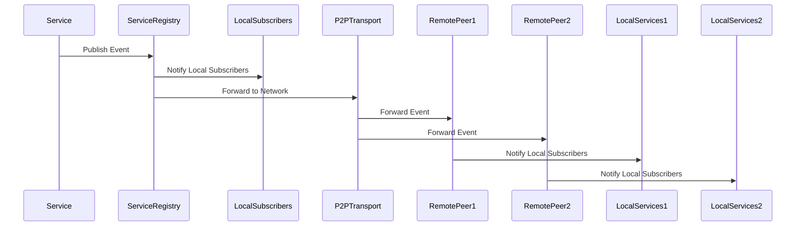
```mermaid
sequenceDiagram
    participant S as Service
    participant SR as ServiceRegistry
    participant LS as LocalSubscribers
    participant P2P as P2PTransport
    participant RP1 as RemotePeer1
    participant RP2 as RemotePeer2
    participant LS1 as LocalServices1
    participant LS2 as LocalServices2

    S->>SR: Publish Event
    SR->>LS: Notify Local Subscribers
    SR->>P2P: Forward to Network
    P2P->>RP1: Forward Event
    P2P->>RP2: Forward Event
    RP1->>LS1: Notify Local Subscribers
    RP2->>LS2: Notify Local Subscribers
```

### Service Subscription Setup
Shows how services set up their subscriptions during initialization.

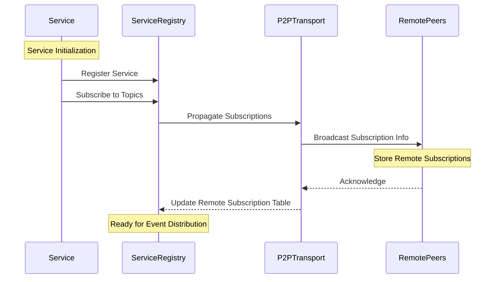
```mermaid
sequenceDiagram
    participant S as Service
    participant SR as ServiceRegistry
    participant P2P as P2PTransport
    participant RP as RemotePeers

    Note over S: Service Initialization
    S->>SR: Register Service
    S->>SR: Subscribe to Topics
    SR->>P2P: Propagate Subscriptions
    P2P->>RP: Broadcast Subscription Info
    Note over RP: Store Remote Subscriptions
    RP-->>P2P: Acknowledge
    P2P-->>SR: Update Remote Subscription Table
    Note over SR: Ready for Event Distribution
```

### DHT Operations
Illustrates how DHT operations are processed.

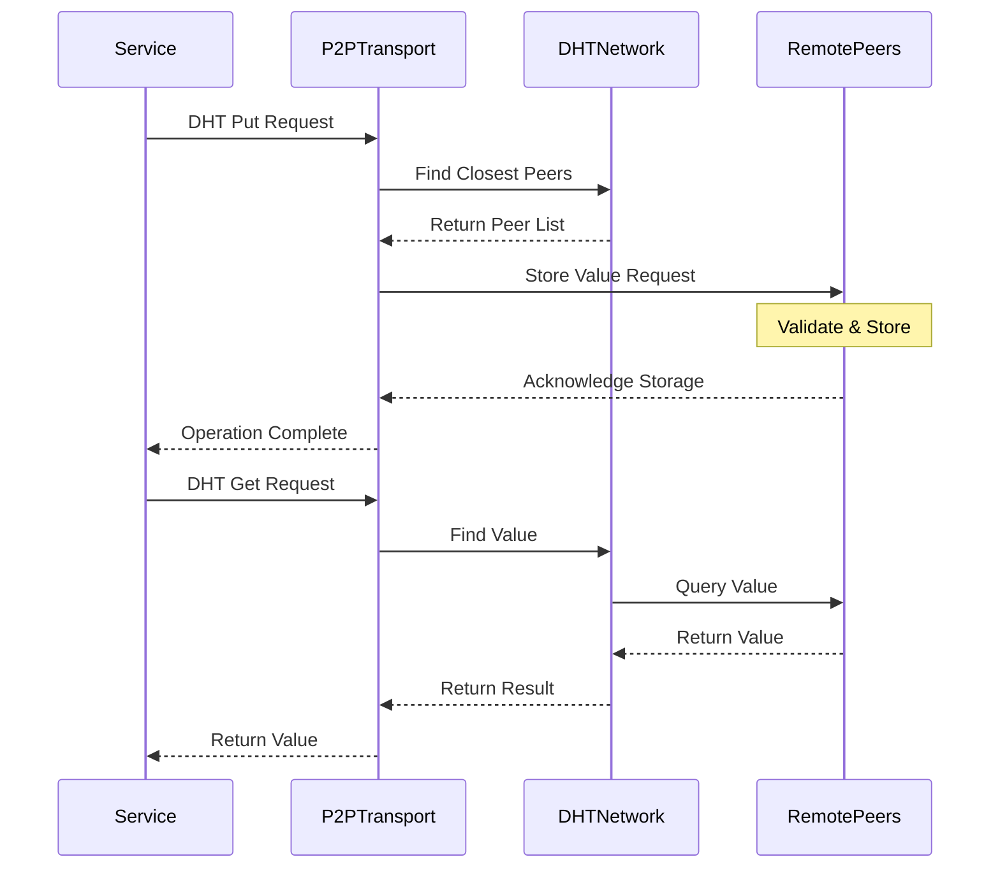
```mermaid
sequenceDiagram
    participant S as Service
    participant P2P as P2PTransport
    participant DHT as DHTNetwork
    participant RP as RemotePeers

    S->>P2P: DHT Put Request
    P2P->>DHT: Find Closest Peers
    DHT-->>P2P: Return Peer List
    P2P->>RP: Store Value Request
    Note over RP: Validate & Store
    RP-->>P2P: Acknowledge Storage
    P2P-->>S: Operation Complete

    S->>P2P: DHT Get Request
    P2P->>DHT: Find Value
    DHT->>RP: Query Value
    RP-->>DHT: Return Value
    DHT-->>P2P: Return Result
    P2P-->>S: Return Value
```

### Service Lifecycle
Shows the different states a service can be in.

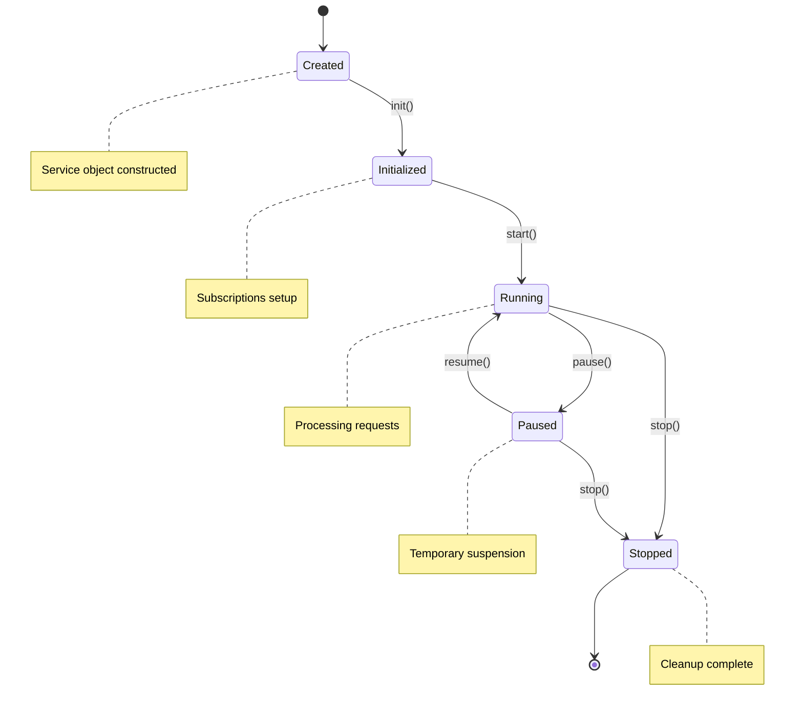
```mermaid
stateDiagram-v2
    [*] --> Created
    Created --> Initialized: init()
    Initialized --> Running: start()
    Running --> Paused: pause()
    Paused --> Running: resume()
    Running --> Stopped: stop()
    Paused --> Stopped: stop()
    Stopped --> [*]

    note right of Created: Service object constructed
    note right of Initialized: Subscriptions setup
    note right of Running: Processing requests
    note right of Paused: Temporary suspension
    note right of Stopped: Cleanup complete
```

### Network Authentication
Shows the authentication process between peers.

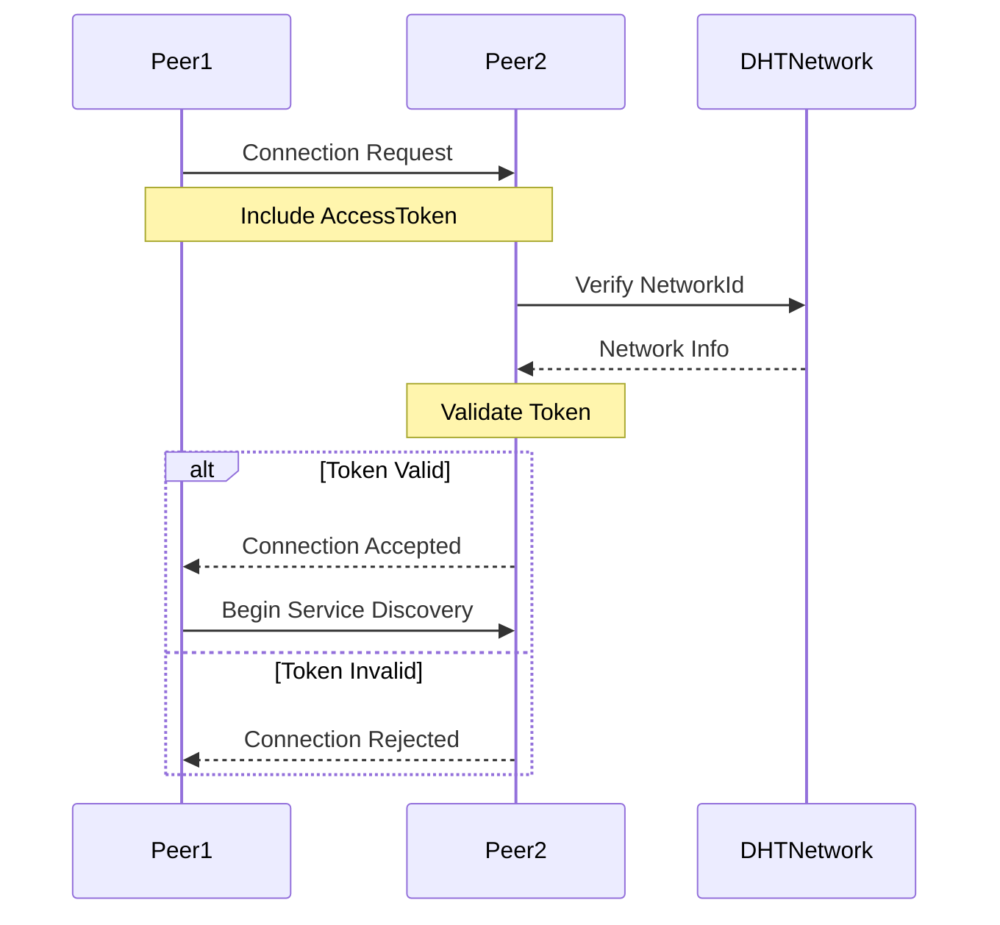
```mermaid
sequenceDiagram
    participant P1 as Peer1
    participant P2 as Peer2
    participant DHT as DHTNetwork

    P1->>P2: Connection Request
    Note over P1,P2: Include AccessToken
    P2->>DHT: Verify NetworkId
    DHT-->>P2: Network Info
    Note over P2: Validate Token
    alt Token Valid
        P2-->>P1: Connection Accepted
        P1->>P2: Begin Service Discovery
    else Token Invalid
        P2-->>P1: Connection Rejected
    end
```

## Flow Diagrams

### Request Processing
Shows how requests are processed through the system.

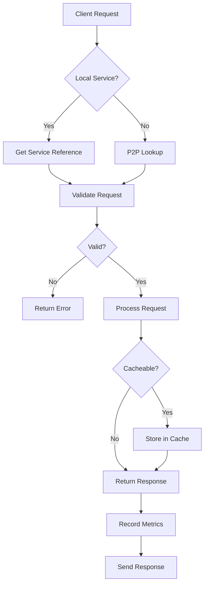
```mermaid
flowchart TD
    A[Client Request] --> B{Local Service?}
    B -->|Yes| C[Get Service Reference]
    B -->|No| D[P2P Lookup]
    
    C --> E[Validate Request]
    D --> E
    
    E --> F{Valid?}
    F -->|No| G[Return Error]
    F -->|Yes| H[Process Request]
    
    H --> I{Cacheable?}
    I -->|Yes| J[Store in Cache]
    I -->|No| K[Return Response]
    J --> K
    
    K --> L[Record Metrics]
    L --> M[Send Response]
```

### Service Initialization
Illustrates the initialization process of a service.

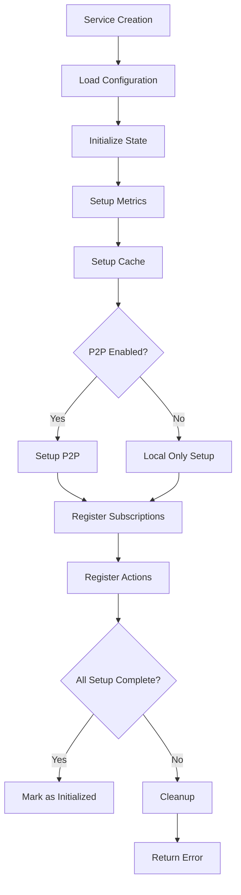
```mermaid
flowchart TD
    A[Service Creation] --> B[Load Configuration]
    B --> C[Initialize State]
    
    C --> D[Setup Metrics]
    D --> E[Setup Cache]
    
    E --> F{P2P Enabled?}
    F -->|Yes| G[Setup P2P]
    F -->|No| H[Local Only Setup]
    
    G --> I[Register Subscriptions]
    H --> I
    
    I --> J[Register Actions]
    J --> K{All Setup Complete?}
    
    K -->|Yes| L[Mark as Initialized]
    K -->|No| M[Cleanup]
    M --> N[Return Error]
```

### P2P Message Routing
Shows how messages are routed in the P2P network.

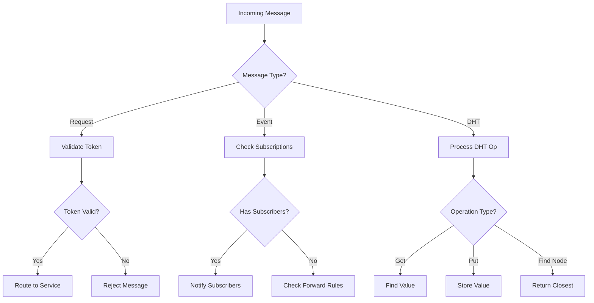
```mermaid
flowchart TD
    A[Incoming Message] --> B{Message Type?}
    
    B -->|Request| C[Validate Token]
    B -->|Event| D[Check Subscriptions]
    B -->|DHT| E[Process DHT Op]
    
    C --> F{Token Valid?}
    F -->|Yes| G[Route to Service]
    F -->|No| H[Reject Message]
    
    D --> I{Has Subscribers?}
    I -->|Yes| J[Notify Subscribers]
    I -->|No| K[Check Forward Rules]
    
    E --> L{Operation Type?}
    L -->|Get| M[Find Value]
    L -->|Put| N[Store Value]
    L -->|Find Node| O[Return Closest]
```

### Cache Operations
Illustrates the flow of cache operations.

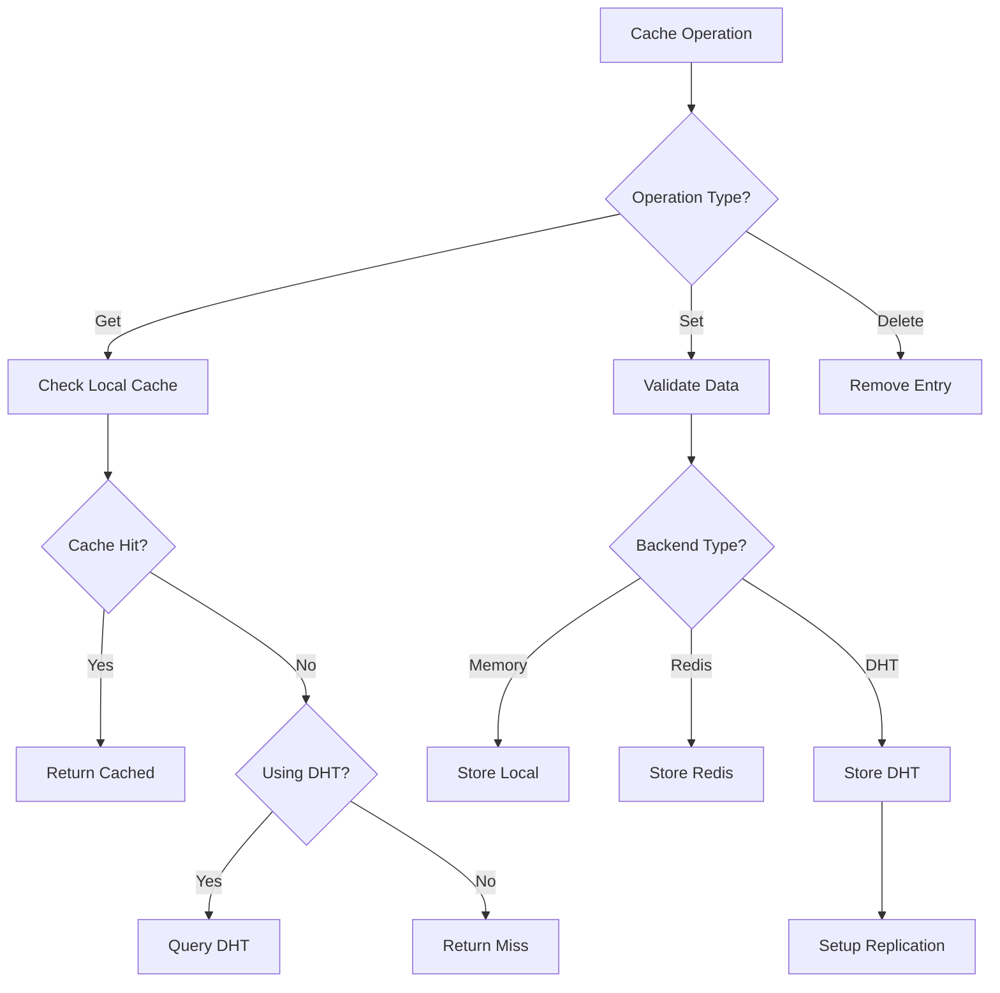
```mermaid
flowchart TD
    A[Cache Operation] --> B{Operation Type?}
    
    B -->|Get| C[Check Local Cache]
    B -->|Set| D[Validate Data]
    B -->|Delete| E[Remove Entry]
    
    C --> F{Cache Hit?}
    F -->|Yes| G[Return Cached]
    F -->|No| H{Using DHT?}
    
    H -->|Yes| I[Query DHT]
    H -->|No| J[Return Miss]
    
    D --> K{Backend Type?}
    K -->|Memory| L[Store Local]
    K -->|Redis| M[Store Redis]
    K -->|DHT| N[Store DHT]
    
    N --> O[Setup Replication]
```

### Event Distribution
Shows how events are distributed through the system.

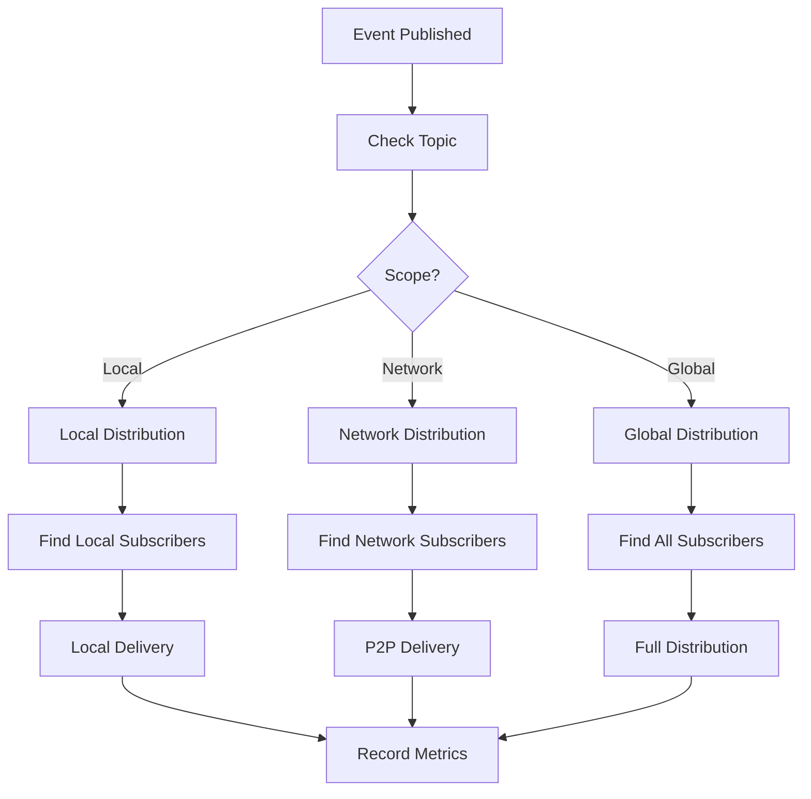
```mermaid
flowchart TD
    A[Event Published] --> B[Check Topic]
    
    B --> C{Scope?}
    C -->|Local| D[Local Distribution]
    C -->|Network| E[Network Distribution]
    C -->|Global| F[Global Distribution]
    
    D --> G[Find Local Subscribers]
    E --> H[Find Network Subscribers]
    F --> I[Find All Subscribers]
    
    G --> J[Local Delivery]
    H --> K[P2P Delivery]
    I --> L[Full Distribution]
    
    J --> M[Record Metrics]
    K --> M
    L --> M
```

### Discovery Process
Illustrates the peer discovery process.

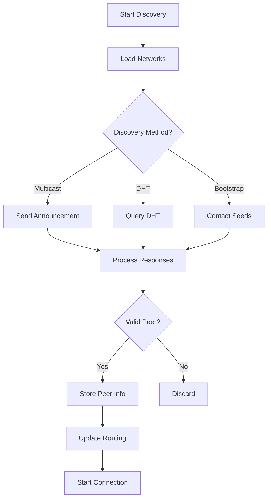
```mermaid
flowchart TD
    A[Start Discovery] --> B[Load Networks]
    
    B --> C{Discovery Method?}
    C -->|Multicast| D[Send Announcement]
    C -->|DHT| E[Query DHT]
    C -->|Bootstrap| F[Contact Seeds]
    
    D --> G[Process Responses]
    E --> G
    F --> G
    
    G --> H{Valid Peer?}
    H -->|Yes| I[Store Peer Info]
    H -->|No| J[Discard]
    
    I --> K[Update Routing]
    K --> L[Start Connection]
```

### Security Flow
Shows the security validation process.

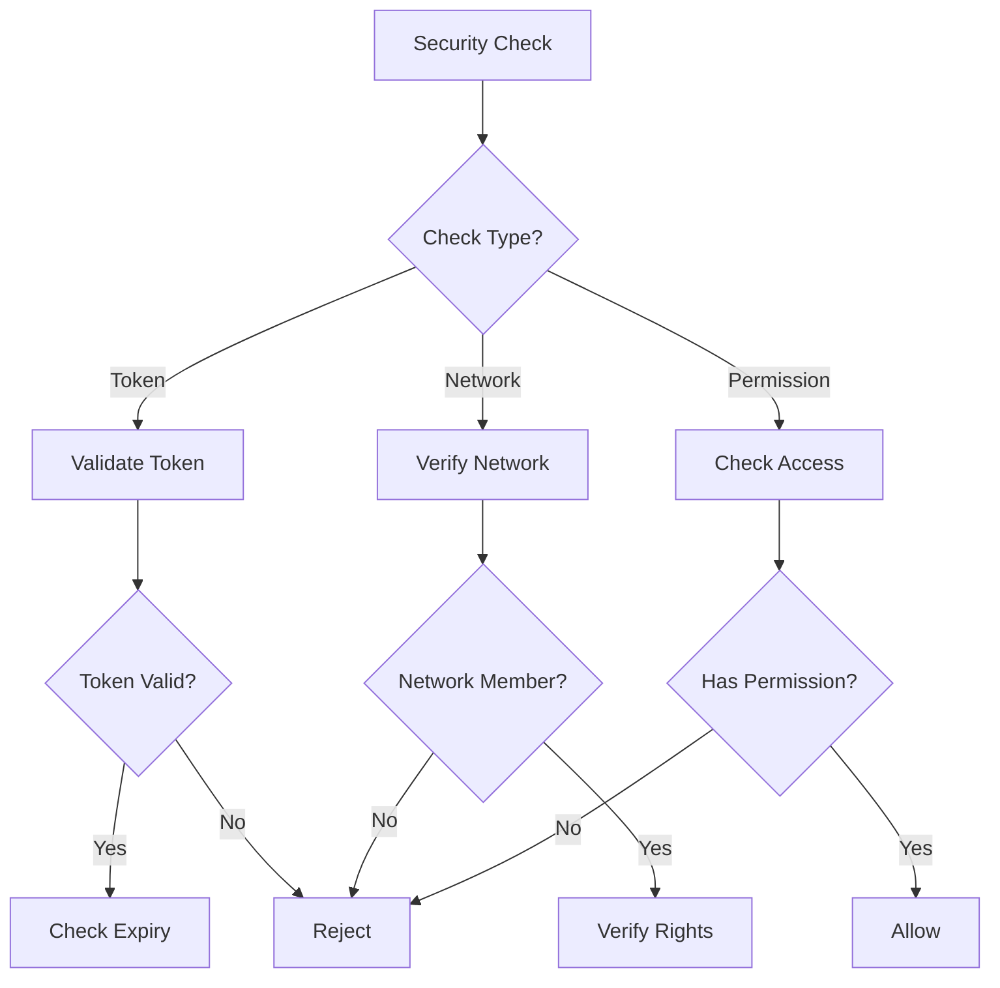
```mermaid
flowchart TD
    A[Security Check] --> B{Check Type?}
    
    B -->|Token| C[Validate Token]
    B -->|Network| D[Verify Network]
    B -->|Permission| E[Check Access]
    
    C --> F{Token Valid?}
    F -->|Yes| G[Check Expiry]
    F -->|No| H[Reject]
    
    D --> I{Network Member?}
    I -->|Yes| J[Verify Rights]
    I -->|No| H
    
    E --> K{Has Permission?}
    K -->|Yes| L[Allow]
    K -->|No| H
```

### Service Communication
Illustrates different types of service communication.

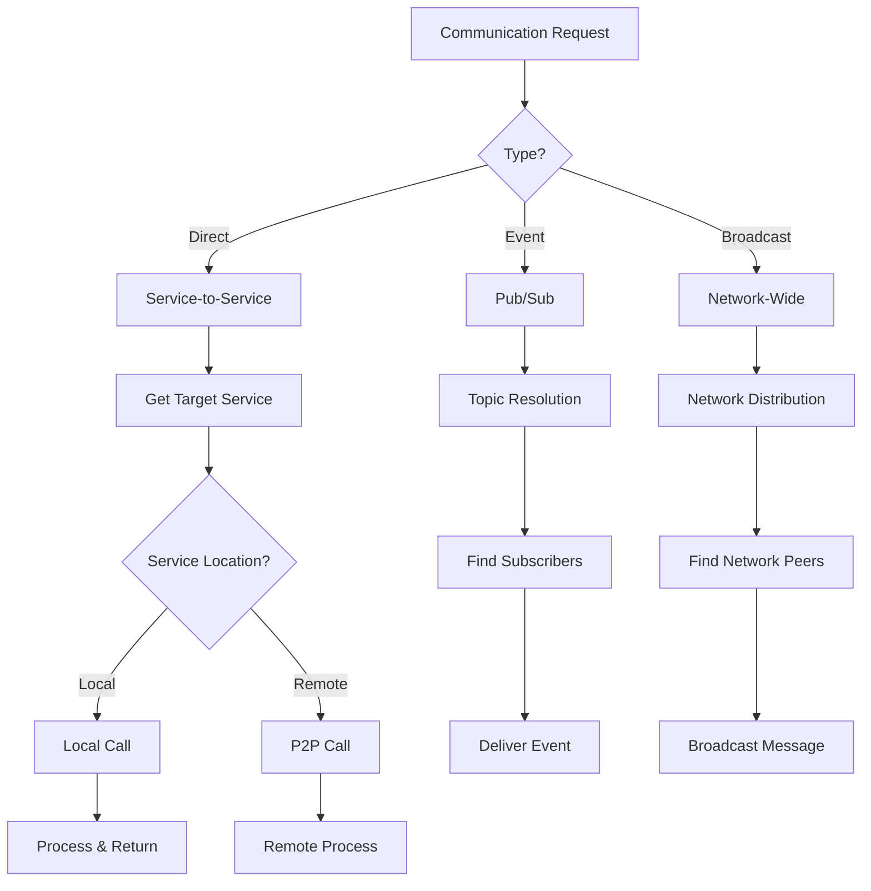
```mermaid
flowchart TD
    A[Communication Request] --> B{Type?}
    
    B -->|Direct| C[Service-to-Service]
    B -->|Event| D[Pub/Sub]
    B -->|Broadcast| E[Network-Wide]
    
    C --> F[Get Target Service]
    D --> G[Topic Resolution]
    E --> H[Network Distribution]
    
    F --> I{Service Location?}
    I -->|Local| J[Local Call]
    I -->|Remote| K[P2P Call]
    
    G --> L[Find Subscribers]
    H --> M[Find Network Peers]
    
    J --> N[Process & Return]
    K --> O[Remote Process]
    L --> P[Deliver Event]
    M --> Q[Broadcast Message]
``` 

## Examples

This section will be expanded with practical examples.
