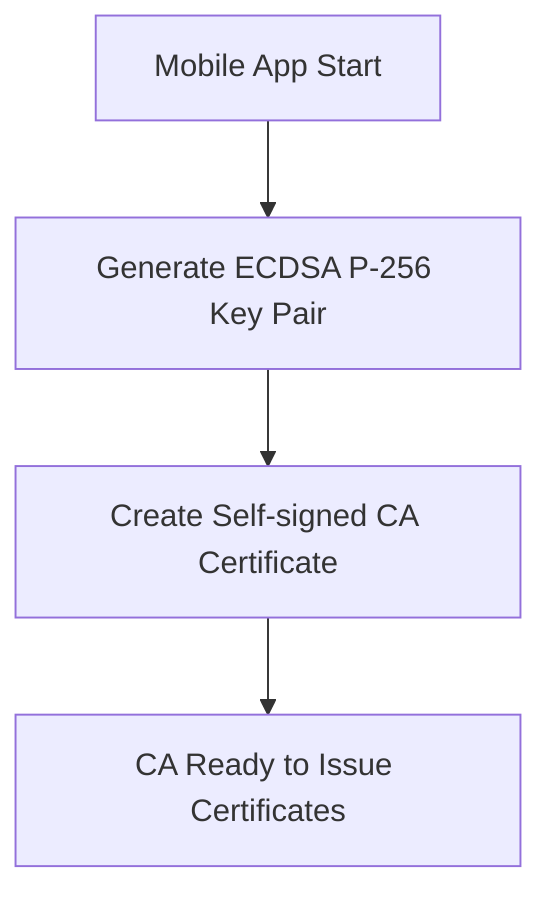
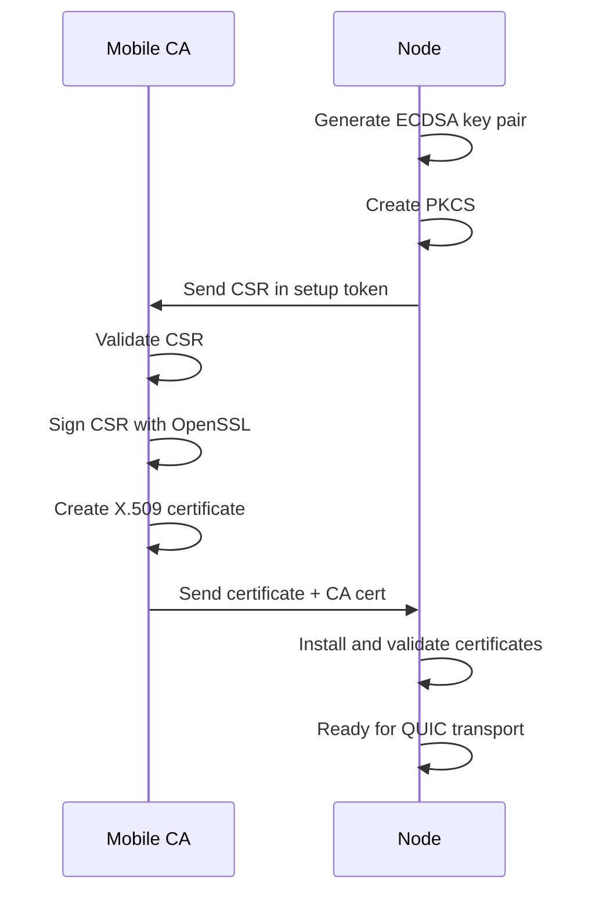
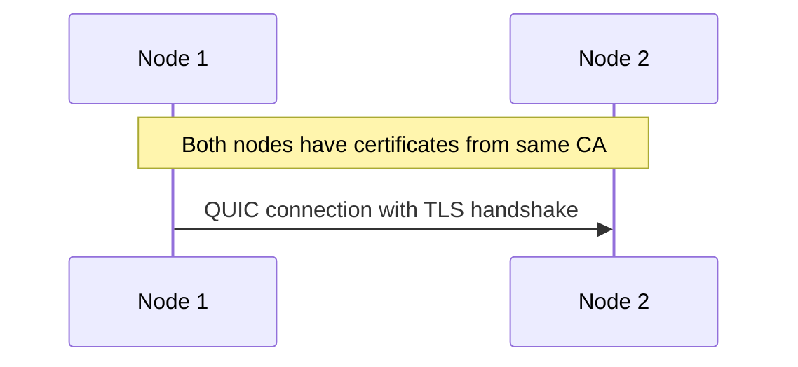
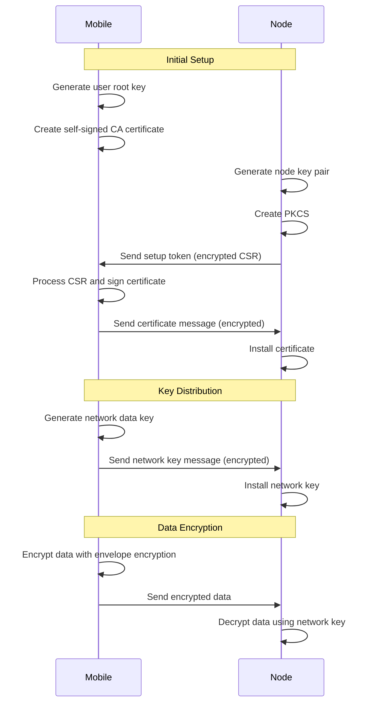

# Runar Encryption Schema

This document describes the comprehensive encryption system in Runar, including the PKI infrastructure, envelope encryption, and selective field encryption capabilities.

## Table of Contents

1. [Overview](#overview)
2. [PKI Infrastructure](#pki-infrastructure)
3. [Key Management](#key-management)
4. [Envelope Encryption](#envelope-encryption)
5. [Selective Field Encryption](#selective-field-encryption)
6. [End-to-End Encryption Flow](#end-to-end-encryption-flow)
7. [Security Considerations](#security-considerations)
8. [API Reference](#api-reference)

## Overview

Runar implements a comprehensive encryption system that provides:
- **PKI Infrastructure**: X.509 certificate-based identity and authentication
- **Envelope Encryption**: Multi-recipient encryption for cross-device data sharing
- **Selective Field Encryption**: Field-level encryption with label-based key resolution
- **Mobile Key Management**: Self-custodied keys with mobile wallet integration

The system is designed for end-to-end encryption where data remains encrypted from producer to consumer, with keys managed by users through their mobile devices.

## PKI Infrastructure

### Certificate Hierarchy

Runar uses a hierarchical PKI system with the following structure:

```
Mobile User CA (Self-signed root certificate)
└── Node TLS Certificate (signed by Mobile CA)
    └── Used for all QUIC/TLS operations
```

### Certificate Workflow

#### Phase 1: CA Initialization


#### Phase 2: Node Certificate Issuance


#### Phase 3: QUIC Transport Setup


### Implementation Details

- **Algorithm**: ECDSA P-256 throughout the entire system
- **Certificate Format**: Standard X.509 with proper extensions
- **CSR Format**: PKCS#10 Certificate Signing Requests
- **Encoding**: DER encoding for all certificate storage and transmission
- **Compliance**: Full compliance with RFC 5280 and related standards

## Key Management

### Key Classes

| Class | Purpose | Storage Location | Derivation |
|-------|---------|------------------|------------|
| **User Root Key** | Master key for mobile wallet | Mobile device (secure storage) | Random generation |
| **User Profile Keys** | Personal/work/family profiles | Mobile device | Derived from root key |
| **Node Storage Keys** | Local node encryption | Node (encrypted storage) | 32-byte random |
| **Network Data Keys** | Cross-network sharing | Mobile + Node | Derived from root key |
| **Envelope Keys** | Ephemeral per-object | Generated on-demand | Ephemeral |

### Key Derivation

Profile keys are derived using HKDF from the user root key:

```rust
// Example key derivation
let root_key = self.user_root_key.as_ref()?;
let root_key_bytes = root_key.private_key_der()?;
let hk = Hkdf::<Sha256>::new(None, &root_key_bytes);

let info = format!("runar-profile-{}", profile_id);
let mut derived_key = [0u8; 32];
hk.expand(info.as_bytes(), &mut derived_key)?;
```

### Key Storage and Security

- **User Root Keys**: Stored in mobile device secure storage (Keychain/Keystore)
- **Profile Keys**: Derived on-demand, never stored persistently
- **Network Keys**: Encrypted and distributed to authorized nodes
- **Node Keys**: Encrypted with node's storage key

## Envelope Encryption

Envelope encryption provides multi-recipient access control for cross-device data sharing.

### Envelope Structure

```rust
pub struct EnvelopeEncryptedData {
    pub encrypted_data: Vec<u8>,           // AES-GCM encrypted payload
    pub network_id: String,                // Network identifier
    pub network_encrypted_key: Vec<u8>,    // Network key encrypted with node key
    pub profile_encrypted_keys: HashMap<String, Vec<u8>>, // Profile keys encrypted with user keys
}
```

### Encryption Process

1. **Generate Ephemeral Key**: Create a random AES-256 key for the data
2. **Encrypt Data**: Use AES-GCM to encrypt the payload with the ephemeral key
3. **Encrypt for Network**: Encrypt the ephemeral key with the network key
4. **Encrypt for Profiles**: Encrypt the ephemeral key with each profile's public key
5. **Assemble Envelope**: Combine all encrypted components

### Decryption Process

1. **Network Decryption**: Node decrypts ephemeral key using network key
2. **Profile Decryption**: Mobile decrypts ephemeral key using profile key
3. **Data Decryption**: Use ephemeral key to decrypt the payload

### Example Usage

```rust
// Mobile side - encrypt data for network and profiles
let test_data = b"This is a test message that should be encrypted and decrypted";
let envelope = mobile.encrypt_with_envelope(
    test_data,
    &network_id,
    vec!["personal".to_string(), "work".to_string()],
)?;

// Node side - decrypt using network key
let decrypted_by_node = node.decrypt_envelope_data(&envelope)?;

// Mobile side - decrypt using profile key
let decrypted_by_mobile = mobile.decrypt_with_profile(&envelope, "personal")?;
```

## Selective Field Encryption

The `runar-serializer` provides selective field encryption using label-based key resolution.

### Field Annotation

```rust
#[derive(Encrypt, serde::Serialize, serde::Deserialize, Debug, PartialEq, Clone)]
pub struct TestProfile {
    pub id: String,
    #[runar(user, system, search)]
    pub name: String,
    #[runar(user, system, search)]
    pub email: String,
    #[runar(user)]
    pub user_private: String,
    #[runar(user, system, search)]
    pub created_at: u64,
}
```

### Label Resolution

Labels are resolved to cryptographic keys through a configurable resolver:

```rust
let mobile_label_config = KeyMappingConfig {
    label_mappings: HashMap::from([
        (
            "user".to_string(),
            LabelKeyInfo {
                public_key: profile_pk.clone(),
                scope: KeyScope::Profile,
            },
        ),
        (
            "system".to_string(),
            LabelKeyInfo {
                public_key: network_pub.clone(),
                scope: KeyScope::Network,
            },
        ),
    ]),
};
```

### Encryption Groups

Fields with the same labels are grouped and encrypted together:

```rust
pub struct EncryptedLabelGroup {
    pub label: String,                    // The label this group was encrypted with
    pub envelope: EnvelopeEncryptedData,  // Envelope-encrypted payload
}
```

### Serialization Process

1. **Field Grouping**: Group fields by their labels
2. **Label Resolution**: Resolve labels to cryptographic keys
3. **Envelope Encryption**: Encrypt each group using envelope encryption
4. **Serialization**: Serialize the encrypted structure

### Access Control

Different entities can access different fields based on their key access:

- **Mobile with Profile Key**: Can decrypt `user` and `system` fields
- **Node with Network Key**: Can decrypt `system` and `search` fields
- **Unauthorized Entity**: Cannot decrypt any fields

## End-to-End Encryption Flow

### Complete Setup Flow



### Data Sharing Example

```rust
// 1. Mobile generates network key
let network_id = mobile.generate_network_data_key()?;

// 2. Mobile creates network key message for node
let network_key_message = mobile.create_network_key_message(
    &network_id, 
    &node_public_key
)?;

// 3. Node installs network key
node.install_network_key(network_key_message)?;

// 4. Mobile encrypts data for sharing
let test_data = b"Shared data that should be encrypted";
let envelope = mobile.encrypt_with_envelope(
    test_data,
    &network_id,
    vec!["personal".to_string()],
)?;

// 5. Node can decrypt the data
let decrypted = node.decrypt_envelope_data(&envelope)?;
assert_eq!(decrypted, test_data);

// 6. Mobile can also decrypt using profile key
let mobile_decrypted = mobile.decrypt_with_profile(&envelope, "personal")?;
assert_eq!(mobile_decrypted, test_data);
```

## Security Considerations

### Key Separation

- **Signing vs Encryption**: Separate keys for different purposes
- **Profile Isolation**: Each profile has independent keys
- **Network Isolation**: Network keys are isolated per network
- **Node Isolation**: Node keys are local to each node

### Forward Secrecy

- **Ephemeral Keys**: Envelope encryption uses ephemeral keys
- **Key Rotation**: Network keys can be rotated
- **Profile Rotation**: Profile keys can be re-derived

### Compromise Impact

- **User Root Key**: Full account compromise
- **Node Key**: Local node data compromise only
- **Network Key**: Network data compromise only
- **Profile Key**: Profile data compromise only

### Backup and Recovery

- **User Root Key**: Must be backed up securely (seed phrase)
- **Profile Keys**: Re-derivable from root key
- **Network Keys**: Re-derivable from root key
- **Node Keys**: Local to node, not backed up

## API Reference

### Mobile Key Manager

```rust
pub struct MobileKeyManager {
    // Initialize with self-signed CA certificate
    pub fn new(logger: Arc<Logger>) -> Result<Self>;
    
    // Generate user root key
    pub fn initialize_user_root_key(&mut self) -> Result<Vec<u8>>;
    
    // Process node CSR and issue certificate
    pub fn process_setup_token(&mut self, token: &SetupToken) -> Result<NodeCertificateMessage>;
    
    // Generate network data key
    pub fn generate_network_data_key(&mut self) -> Result<String>;
    
    // Create network key message for node
    pub fn create_network_key_message(&self, network_id: &str, node_id: &str) -> Result<NetworkKeyMessage>;
    
    // Derive user profile key
    pub fn derive_user_profile_key(&mut self, profile_id: &str) -> Result<Vec<u8>>;
    
    // Envelope encryption
    pub fn encrypt_with_envelope(&self, data: &[u8], network_id: &str, profile_ids: Vec<String>) -> Result<EnvelopeEncryptedData>;
    
    // Profile decryption
    pub fn decrypt_with_profile(&self, envelope: &EnvelopeEncryptedData, profile_id: &str) -> Result<Vec<u8>>;
}
```

### Node Key Manager

```rust
pub struct NodeKeyManager {
    // Generate node identity and CSR
    pub fn new(logger: Arc<Logger>) -> Result<Self>;
    pub fn generate_csr(&mut self) -> Result<SetupToken>;
    
    // Install certificate from mobile
    pub fn install_certificate(&mut self, cert_message: NodeCertificateMessage) -> Result<()>;
    
    // Install network key from mobile
    pub fn install_network_key(&mut self, key_message: NetworkKeyMessage) -> Result<()>;
    
    // Get QUIC certificate configuration
    pub fn get_quic_certificate_config(&self) -> Result<QuicCertificateConfig>;
    
    // Envelope decryption
    pub fn decrypt_envelope_data(&self, envelope: &EnvelopeEncryptedData) -> Result<Vec<u8>>;
    
    // Local storage encryption
    pub fn encrypt_local_data(&self, data: &[u8]) -> Result<Vec<u8>>;
    pub fn decrypt_local_data(&self, encrypted_data: &[u8]) -> Result<Vec<u8>>;
}
```

### Serializer Registry

```rust
pub struct SerializerRegistry {
    // Create registry with keystore and label resolver
    pub fn with_keystore(
        logger: Arc<Logger>,
        keystore: Arc<dyn KeyStore>,
        resolver: Arc<dyn LabelResolver>,
    ) -> Self;
    
    // Register encryptable types
    pub fn register_encryptable<T: Encrypt + 'static>(&mut self) -> Result<()>;
    
    // Serialize with encryption
    pub fn serialize_value(&self, value: &ArcValue) -> Result<Vec<u8>>;
    
    // Deserialize with decryption
    pub fn deserialize_value(&self, data: Vec<u8>) -> Result<ArcValue>;
    
    // Decrypt label group
    pub fn decrypt_label_group<T: for<'de> Deserialize<'de>>(&self, group: &EncryptedLabelGroup) -> Result<T>;
}
```

---

*This documentation reflects the current implementation as of the latest release. For implementation details, see the end-to-end tests in `runar-keys/tests/end_to_end_test.rs` and `runar-serializer/src/tests.rs`.* 