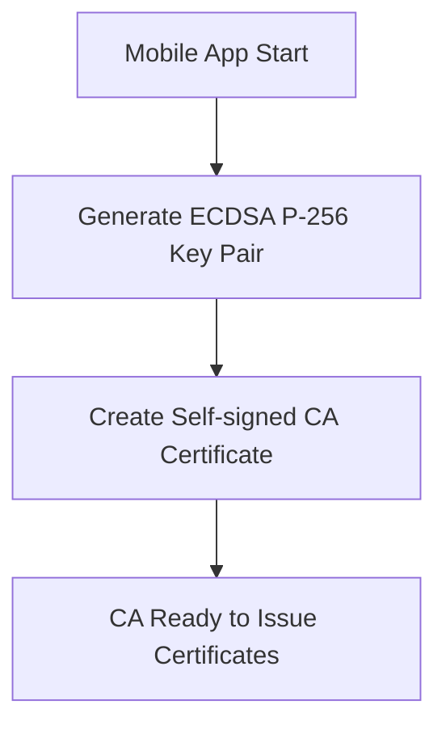
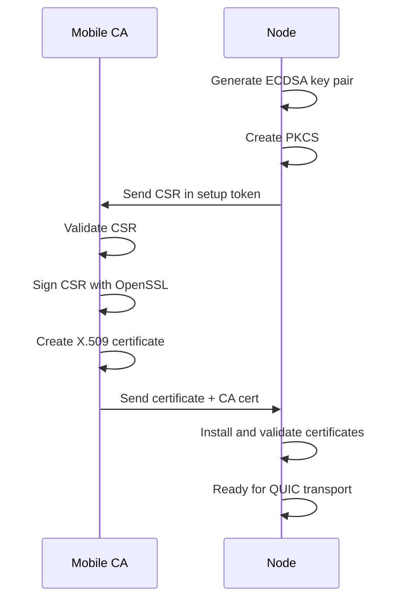
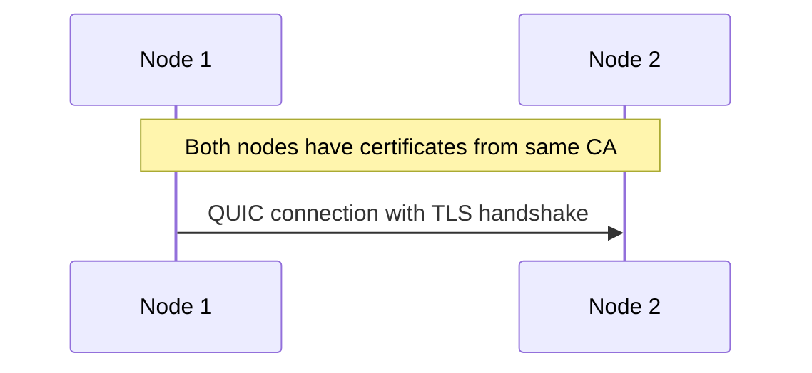

# Runar Key Management System

This document describes the comprehensive key management system in Runar, including PKI infrastructure, envelope encryption, and mobile key management capabilities.

## Table of Contents

1. [Overview](#overview)
2. [PKI Infrastructure](#pki-infrastructure)
3. [Key Classes](#key-classes)
4. [Mobile Key Management](#mobile-key-management)
5. [Node Key Management](#node-key-management)
6. [Envelope Encryption](#envelope-encryption)
7. [Certificate Workflow](#certificate-workflow)
8. [Security Considerations](#security-considerations)
9. [API Reference](#api-reference)

## Overview

Runar implements a production-ready key management system that provides:

- **PKI Infrastructure**: X.509 certificate-based identity and authentication
- **Mobile Key Management**: Self-custodied keys with mobile wallet integration
- **Envelope Encryption**: Multi-recipient encryption for cross-device data sharing
- **Node Local Encryption**: Secure local storage encryption
- **Profile-based Access Control**: User profile keys for personal/work/family data

The system is designed for end-to-end encryption where data remains encrypted from producer to consumer, with keys managed by users through their mobile devices.

## PKI Infrastructure

### Certificate Hierarchy

Runar uses a hierarchical PKI system with the following structure:

```
Mobile User CA (Self-signed root certificate)
└── Node TLS Certificate (signed by Mobile CA)
    └── Used for all QUIC/TLS operations
```

### Certificate Standards

- **Algorithm**: ECDSA P-256 throughout the entire system
- **Certificate Format**: Standard X.509 with proper extensions
- **CSR Format**: PKCS#10 Certificate Signing Requests
- **Encoding**: DER encoding for all certificate storage and transmission
- **Compliance**: Full compliance with RFC 5280 and related standards

### QUIC Transport Security

The system provides QUIC/TLS compatibility through:

- **Certificate Chains**: Node certificate + CA certificate
- **Private Key Format**: PKCS#8 compatible with rustls/Quinn
- **Certificate Validation**: Full cryptographic validation with DN normalization
- **Peer Authentication**: Mutual authentication during QUIC handshake

## Key Classes

| Class | Purpose | Storage Location | Derivation | Algorithm |
|-------|---------|------------------|------------|-----------|
| **User Root Key** | Master key for mobile wallet | Mobile device (secure storage) | Random generation | ECDSA P-256 |
| **User Profile Keys** | Personal/work/family profiles | Mobile device | Derived from root key | ECDSA P-256 |
| **Node Storage Keys** | Local node encryption | Node (encrypted storage) | 32-byte random | AES-256 |
| **Network Data Keys** | Cross-network sharing | Mobile + Node | Derived from root key | ECDSA P-256 |
| **Envelope Keys** | Ephemeral per-object | Generated on-demand | Ephemeral | AES-256-GCM |

### Key Derivation

Profile keys are derived using HKDF from the user root key:

```rust
// Example key derivation
let root_key = self.user_root_key.as_ref()?;
let root_key_bytes = root_key.private_key_der()?;
let hk = Hkdf::<Sha256>::new(None, &root_key_bytes);

let info = format!("runar-profile-{}", profile_id);
let mut derived_key = [0u8; 32];
hk.expand(info.as_bytes(), &mut derived_key)?;
```

## Mobile Key Management

The `MobileKeyManager` provides comprehensive key management for mobile devices:

### Core Operations

```rust
pub struct MobileKeyManager {
    ca_key_pair: EcdsaKeyPair,
    ca_certificate: X509Certificate,
    user_keys: HashMap<String, EcdsaKeyPair>,
    network_keys: HashMap<String, EcdsaKeyPair>,
}
```

### Key Generation and Management

1. **User Root Key Initialization**
   ```rust
   let user_root_public_key = mobile.initialize_user_root_key()?;
   ```

2. **Profile Key Derivation**
   ```rust
   let profile_personal_key = mobile.derive_user_profile_key("personal")?;
   let profile_work_key = mobile.derive_user_profile_key("work")?;
   ```

3. **Network Key Generation**
   ```rust
   let network_id = mobile.generate_network_data_key()?;
   ```

### Certificate Authority Operations

1. **CSR Processing**
   ```rust
   let cert_message = mobile.process_setup_token(&setup_token)?;
   ```

2. **Certificate Issuance**
   - Validates CSR structure and signature
   - Signs with OpenSSL using CA private key
   - Creates X.509 certificate with proper extensions
   - Returns certificate + CA certificate

### Envelope Encryption

```rust
// Encrypt data for network and profiles
let envelope = mobile.encrypt_with_envelope(
    test_data,
    &network_id,
    vec!["personal".to_string(), "work".to_string()],
)?;

// Decrypt using profile key
let decrypted = mobile.decrypt_with_profile(&envelope, "personal")?;
```

## Node Key Management

The `NodeKeyManager` provides key management for nodes:

### Core Operations

```rust
pub struct NodeKeyManager {
    node_key_pair: EcdsaKeyPair,
    node_certificate: Option<X509Certificate>,
    ca_certificate: Option<X509Certificate>,
    certificate_validator: Option<CertificateValidator>,
    network_keys: HashMap<String, EcdsaKeyPair>,
}
```

### Certificate Management

1. **CSR Generation**
   ```rust
   let setup_token = node.generate_csr()?;
   ```

2. **Certificate Installation**
   ```rust
   node.install_certificate(cert_message)?;
   ```

3. **QUIC Configuration**
   ```rust
   let quic_config = node.get_quic_certificate_config()?;
   ```

### Network Key Management

1. **Network Key Installation**
   ```rust
   node.install_network_key(network_key_message)?;
   ```

2. **Envelope Decryption**
   ```rust
   let decrypted = node.decrypt_envelope_data(&envelope)?;
   ```

### Local Storage Encryption

```rust
// Encrypt local data
let encrypted = node.encrypt_local_data(file_data)?;

// Decrypt local data
let decrypted = node.decrypt_local_data(&encrypted)?;
```

## Envelope Encryption

Envelope encryption provides multi-recipient access control for cross-device data sharing.

### Envelope Structure

```rust
pub struct EnvelopeEncryptedData {
    pub encrypted_data: Vec<u8>,           // AES-GCM encrypted payload
    pub network_id: String,                // Network identifier
    pub network_encrypted_key: Vec<u8>,    // Network key encrypted with node key
    pub profile_encrypted_keys: HashMap<String, Vec<u8>>, // Profile keys encrypted with user keys
}
```

### Encryption Process

1. **Generate Ephemeral Key**: Create a random AES-256 key for the data
2. **Encrypt Data**: Use AES-GCM to encrypt the payload with the ephemeral key
3. **Encrypt for Network**: Encrypt the ephemeral key with the network key
4. **Encrypt for Profiles**: Encrypt the ephemeral key with each profile's public key
5. **Assemble Envelope**: Combine all encrypted components

### Decryption Process

1. **Network Decryption**: Node decrypts ephemeral key using network key
2. **Profile Decryption**: Mobile decrypts ephemeral key using profile key
3. **Data Decryption**: Use ephemeral key to decrypt the payload

## Certificate Workflow

### Phase 1: CA Initialization


### Phase 2: Node Certificate Issuance


### Phase 3: QUIC Transport Setup


## Security Considerations

### Key Separation

- **Signing vs Encryption**: Separate keys for different purposes
- **Profile Isolation**: Each profile has independent keys
- **Network Isolation**: Network keys are isolated per network
- **Node Isolation**: Node keys are local to each node

### Forward Secrecy

- **Ephemeral Keys**: Envelope encryption uses ephemeral keys
- **Key Rotation**: Network keys can be rotated
- **Profile Rotation**: Profile keys can be re-derived

### Compromise Impact

- **User Root Key**: Full account compromise
- **Node Key**: Local node data compromise only
- **Network Key**: Network data compromise only
- **Profile Key**: Profile data compromise only

### Backup and Recovery

- **User Root Key**: Must be backed up securely (seed phrase)
- **Profile Keys**: Re-derivable from root key
- **Network Keys**: Re-derivable from root key
- **Node Keys**: Local to node, not backed up

## API Reference

### Mobile Key Manager

```rust
pub struct MobileKeyManager {
    // Initialize with self-signed CA certificate
    pub fn new(logger: Arc<Logger>) -> Result<Self>;
    
    // Generate user root key
    pub fn initialize_user_root_key(&mut self) -> Result<Vec<u8>>;
    
    // Process node CSR and issue certificate
    pub fn process_setup_token(&mut self, token: &SetupToken) -> Result<NodeCertificateMessage>;
    
    // Generate network data key
    pub fn generate_network_data_key(&mut self) -> Result<String>;
    
    // Create network key message for node
    pub fn create_network_key_message(&self, network_id: &str, node_id: &str) -> Result<NetworkKeyMessage>;
    
    // Derive user profile key
    pub fn derive_user_profile_key(&mut self, profile_id: &str) -> Result<Vec<u8>>;
    
    // Envelope encryption
    pub fn encrypt_with_envelope(&self, data: &[u8], network_id: &str, profile_ids: Vec<String>) -> Result<EnvelopeEncryptedData>;
    
    // Profile decryption
    pub fn decrypt_with_profile(&self, envelope: &EnvelopeEncryptedData, profile_id: &str) -> Result<Vec<u8>>;
}
```

### Node Key Manager

```rust
pub struct NodeKeyManager {
    // Generate node identity and CSR
    pub fn new(logger: Arc<Logger>) -> Result<Self>;
    pub fn generate_csr(&mut self) -> Result<SetupToken>;
    
    // Install certificate from mobile
    pub fn install_certificate(&mut self, cert_message: NodeCertificateMessage) -> Result<()>;
    
    // Install network key from mobile
    pub fn install_network_key(&mut self, key_message: NetworkKeyMessage) -> Result<()>;
    
    // Get QUIC certificate configuration
    pub fn get_quic_certificate_config(&self) -> Result<QuicCertificateConfig>;
    
    // Envelope decryption
    pub fn decrypt_envelope_data(&self, envelope: &EnvelopeEncryptedData) -> Result<Vec<u8>>;
    
    // Local storage encryption
    pub fn encrypt_local_data(&self, data: &[u8]) -> Result<Vec<u8>>;
    pub fn decrypt_local_data(&self, encrypted_data: &[u8]) -> Result<Vec<u8>>;
}
```

### Certificate Authority

```rust
pub struct CertificateAuthority {
    // Create CA with self-signed certificate
    pub fn new(subject: &str) -> Result<Self>;
    
    // Sign CSR using OpenSSL to create proper X.509 certificate
    pub fn sign_certificate_request(&self, csr_der: &[u8], validity_days: u32) -> Result<X509Certificate>;
    
    // Get CA certificate for distribution
    pub fn ca_certificate(&self) -> &X509Certificate;
}
```

### Certificate Validator

```rust
pub struct CertificateValidator {
    // Full cryptographic validation with DN normalization
    pub fn validate_certificate(&self, certificate: &X509Certificate) -> Result<()>;
    
    // Complete certificate chain validation
    pub fn validate_certificate_chain(&self, certificate: &X509Certificate, chain: &[X509Certificate]) -> Result<()>;
    
    // TLS-specific validation
    pub fn validate_for_tls_server(&self, certificate: &X509Certificate) -> Result<()>;
}
```

---

*This documentation reflects the current implementation as of the latest release. For implementation details, see the end-to-end tests in `runar-keys/tests/end_to_end_test.rs`.*

*Last updated: 2025-01-27*
