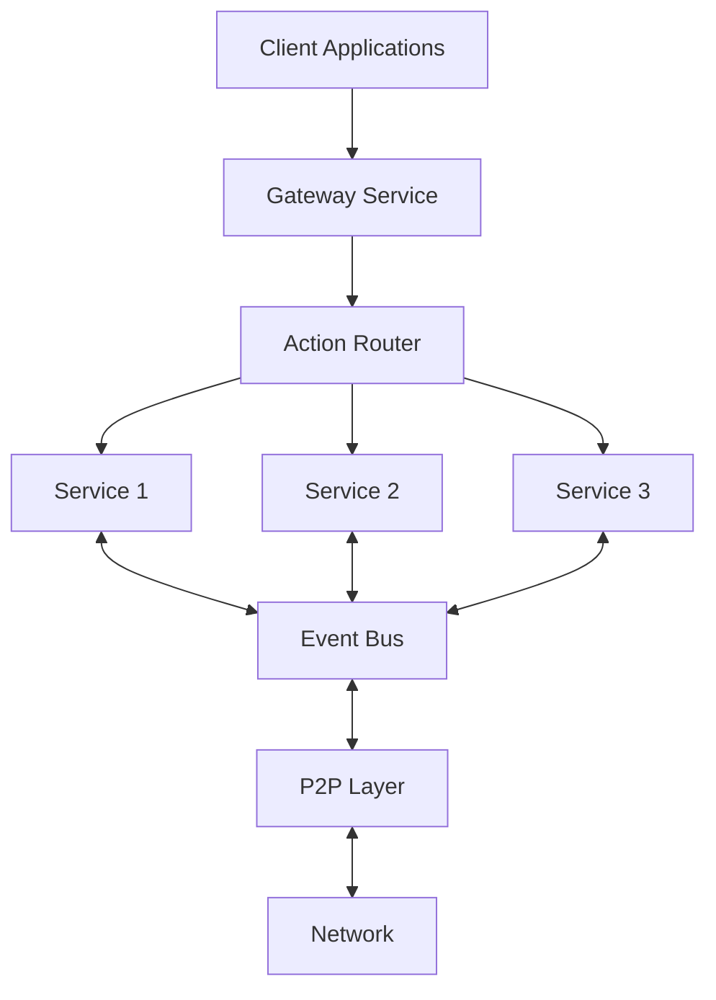

# Kagi Overview

## Introduction

Kagi is a powerful distributed system framework built in Rust. It provides a declarative, Actix-inspired approach to defining services, actions, and event subscriptions for building resilient peer-to-peer applications.

## Key Features

- **Distributed Architecture**: Fully distributed with no central points of failure
- **End-to-End Encryption**: Secure communication between nodes
- **Declarative API**: Easy-to-use macros for defining services and handlers
- **Event-Based Communication**: Publish-subscribe pattern for system events
- **Fault Tolerance**: Resilient to network failures and node crashes
- **Extensible**: Easy to add new services and functionality

## Core Components

Kagi consists of several core components:

1. **Node**: The main runtime that hosts services and manages communication
2. **Services**: Independent modules that provide specific functionality
3. **Actions**: Request handlers that process incoming service requests
4. **Events**: Asynchronous messages for inter-service communication
5. **Discovery**: Mechanism for finding other nodes in the network
6. **P2P Layer**: Peer-to-peer communication layer

## Architecture Overview

The following diagram illustrates the high-level architecture of a Kagi node:



## Service Model

Services in Kagi are defined using a declarative approach with macros:

```rust
#[kagi::service(name = "example_service")]
struct ExampleService {
    // Service state
}

impl ExampleService {
    #[action("perform_task")]
    async fn perform_task(&self, context: &RequestContext, 
                         #[param("input")] input: String) -> Result<ServiceResponse> {
        // Handler implementation
    }
    
    #[subscribe("event/type")]
    async fn handle_event(&self, payload: serde_json::Value) -> Result<()> {
        // Event handler implementation
    }
}
```

## Next Steps

- [Installation Guide](installation) - Install Kagi and its dependencies
- [Quick Start Guide](quickstart) - Build your first Kagi application
- [Architecture](../core/architecture) - Detailed architecture documentation