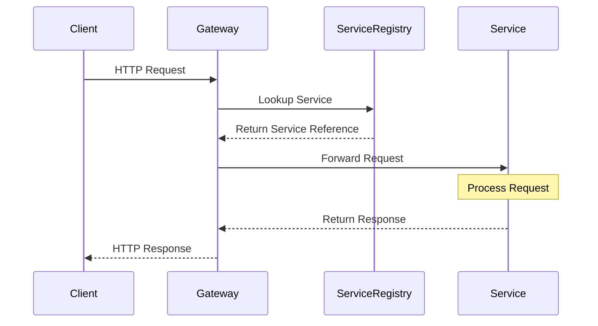
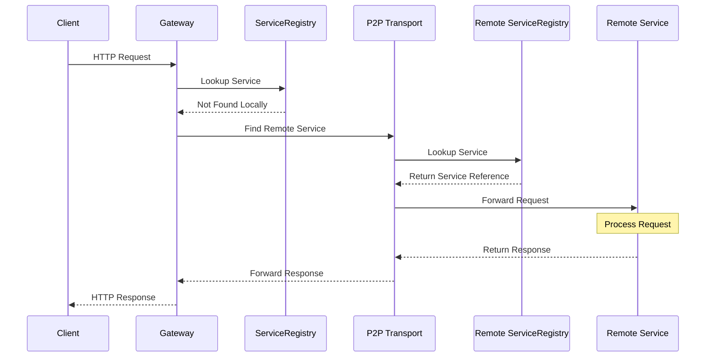
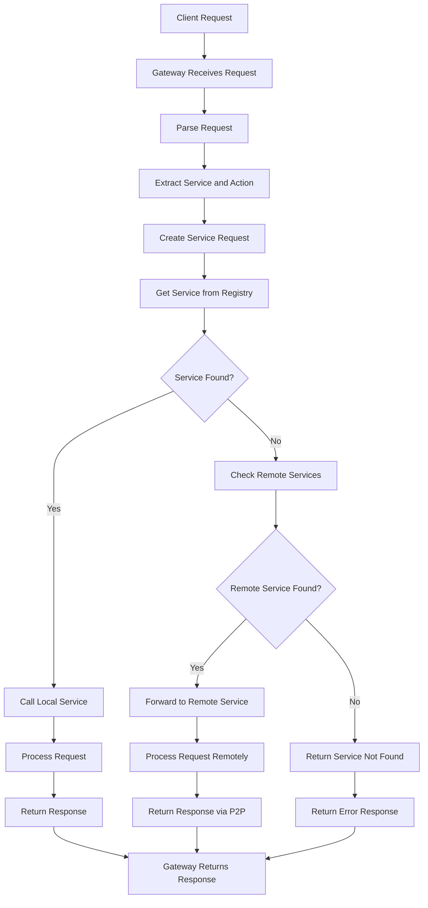
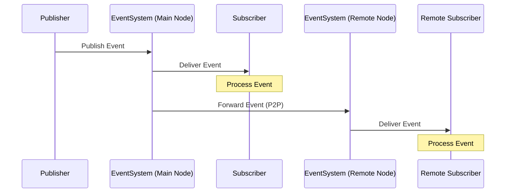
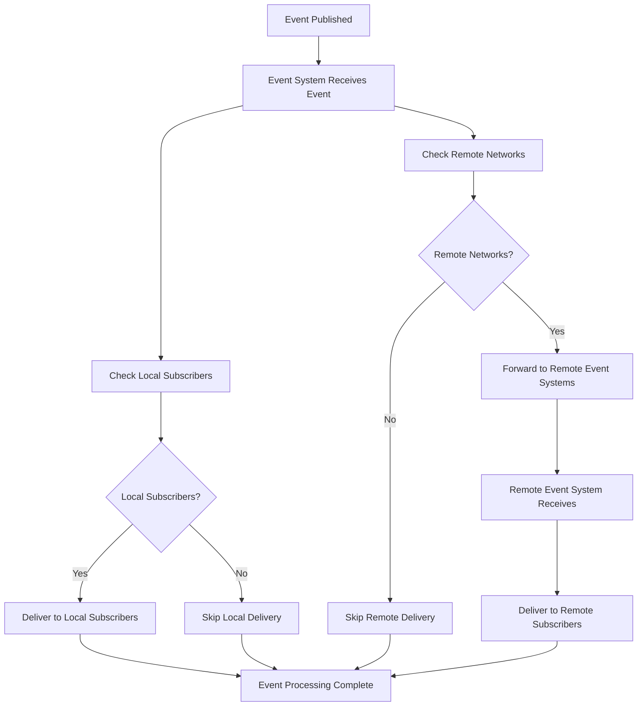

# Kagi Node API Documentation

This document describes the API for developing services in the Kagi Node system, including service creation, action implementation, event publishing, and event subscription patterns.

## Table of Contents

1. [Introduction](#introduction)
2. [Service Definition](#service-definition)
   - [Creating a Service](#creating-a-service)
   - [Service Lifecycle](#service-lifecycle)
   - [Service State Management](#service-state-management)
3. [Action Implementation](#action-implementation)
   - [Implementing Operations](#implementing-operations)
   - [Request-Response Pattern](#request-response-pattern)
   - [Service-to-Service Communication](#service-to-service-communication)
4. [Event System](#event-system)
   - [Publishing Events](#publishing-events)
   - [Subscribing to Events](#subscribing-to-events)
   - [Event Handler Lifecycle](#event-handler-lifecycle)
   - [Advanced Subscription Options](#advanced-subscription-options)
5. [Best Practices](#best-practices)
   - [Service Implementation](#service-implementation-best-practices)
   - [Subscription Management](#subscription-management-best-practices)
   - [Error Handling](#error-handling)

## Introduction

The Kagi Node system follows a modular, service-oriented architecture where each component is implemented as a service. This document explains how to develop services, implement actions/operations, and work with the event-driven pub/sub system.

Services in Kagi are isolated components that communicate with each other only through well-defined interfaces (request/response and publish/subscribe patterns). The system is designed to be extensible and to support distributed deployment.

## Service Definition

### Creating a Service

To create a service, you need to:
1. Define a struct that represents your service
2. Implement the `AbstractService` trait for your struct

Here's a minimal example:

```rust
use anyhow::Result;
use async_trait::async_trait;
use kagi_node::services::{
    AbstractService, ServiceRequest, ServiceResponse, 
    RequestContext, ResponseStatus, ValueType, ServiceState
};
use std::sync::Mutex;

struct MyService {
    name: String,
    path: String,
    state: Mutex<ServiceState>,
}

impl MyService {
    fn new(name: &str) -> Self {
        MyService {
            name: name.to_string(),
            path: name.to_string(),
            state: Mutex::new(ServiceState::Created),
        }
    }
    
    // Service-specific methods go here
    
    // Implementation of operation1
    async fn operation1(&self, _request: &ServiceRequest) -> Result<ServiceResponse> {
        // Implement action here...
        Ok(ServiceResponse {
            status: ResponseStatus::Success,
            message: "Operation completed successfully".to_string(),
            data: None,
        })
    }
    
    // Implementation of operation2
    async fn operation2(&self, request: &ServiceRequest) -> Result<ServiceResponse> {
        // Implement action here...
        let param = request
            .get_param("param")
            .and_then(|v| v.as_str().map(|s| s.to_string()))
            .unwrap_or_default();
            
        Ok(ServiceResponse {
            status: ResponseStatus::Success,
            message: format!("Operation2 with param: {}", param),
            data: None,
        })
    }
}

#[async_trait]
impl AbstractService for MyService {
    fn name(&self) -> &str {
        &self.name
    }

    fn path(&self) -> &str {
        &self.path
    }

    fn state(&self) -> ServiceState {
        *self.state.lock().unwrap()
    }

    fn description(&self) -> &str {
        "My custom service"
    }
    
    fn version(&self) -> &str {
        "1.0.0"
    }

    async fn init(&self, context: &RequestContext) -> Result<()> {
        // Initialize the service
        let mut state = self.state.lock().unwrap();
        *state = ServiceState::Initialized;
        Ok(())
    }

    async fn start(&self) -> Result<()> {
        // Start the service
        let mut state = self.state.lock().unwrap();
        *state = ServiceState::Running;
        Ok(())
    }

    async fn stop(&self) -> Result<()> {
        // Stop the service
        let mut state = self.state.lock().unwrap();
        *state = ServiceState::Stopped;
        Ok(())
    }

    async fn handle_request(&self, request: ServiceRequest) -> Result<ServiceResponse> {
        // Delegate to operation-specific methods
        match request.operation.as_str() {
            "operation1" => self.operation1(&request).await,
            "operation2" => self.operation2(&request).await,
            _ => Ok(ServiceResponse {
                status: ResponseStatus::Error,
                message: format!("Unknown operation: {}", request.operation),
                data: None,
            }),
        }
    }
}

### Service Lifecycle

Services in Kagi go through a well-defined lifecycle:

1. **Creation**: The service object is instantiated.
2. **Initialization**: The `init` method is called, allowing the service to set up resources, establish subscriptions, etc.
3. **Starting**: The `start` method is called when the service is ready to begin operation.
4. **Running**: The service processes requests while in the Running state.
5. **Stopping**: The `stop` method is called when the service is being shut down.

### Service State Management

Services have a state property that reflects their current lifecycle stage:

```rust
pub enum ServiceState {
    Created,       // Service is created but not initialized
    Initialized,   // Service is initialized but not running
    Running,       // Service is running
    Paused,        // Service is paused
    Stopped,       // Service is stopped
    Failed,        // Service has failed
}
```

It's recommended to use a `Mutex` or similar synchronization primitive to manage the service state safely in a concurrent environment.

## Action Implementation

### Implementing Operations

Operations (also called actions) are implemented in the `process_request` method of your service by delegating to separate methods:

```rust
// In impl MyService block:

// Implementation methods for each operation
async fn get_data(&self, request: &ServiceRequest) -> Result<ServiceResponse> {
    // Extract parameters
    let id = request
        .get_param("id")
        .and_then(|v| v.as_str().map(String::from))
        .ok_or_else(|| anyhow!("Missing required parameter: id"))?;
        
    // Implement action here...
    
    Ok(ServiceResponse {
        status: ResponseStatus::Success,
        message: "Data retrieved successfully".to_string(),
        data: None,
    })
}

async fn update_data(&self, request: &ServiceRequest) -> Result<ServiceResponse> {
    // Extract parameters
    let id = request
        .get_param("id")
        .and_then(|v| v.as_str().map(String::from))
        .ok_or_else(|| anyhow!("Missing required parameter: id"))?;
        
    let value = request
        .get_param("value")
        .and_then(|v| v.as_str().map(String::from))
        .ok_or_else(|| anyhow!("Missing required parameter: value"))?;
    
    // Implement action here...
    
    Ok(ServiceResponse {
        status: ResponseStatus::Success,
        message: "Data updated successfully".to_string(),
        data: None,
    })
}

// In AbstractService implementation:
async fn process_request(&self, request: ServiceRequest) -> Result<ServiceResponse> {
    // Delegate to operation-specific methods
    match request.operation.as_str() {
        "get_data" => self.get_data(&request).await,
        "update_data" => self.update_data(&request).await,
        "delete_data" => self.delete_data(&request).await,
        _ => Ok(ServiceResponse {
            status: ResponseStatus::Error,
            message: format!("Unknown operation: {}", request.operation),
            data: None,
        }),
    }
}
```

Following the architecture guidelines, each operation should be delegated to a separate method for better organization and testability. This improves code readability, maintainability, and allows for more focused unit testing of each operation.

### Request-Response Pattern

The request-response pattern is the primary way services communicate:

1. A client (or another service) sends a request to a service
2. The service processes the request
3. The service returns a response

Requests are directed using a path in the format `serviceName/operation`. Parameters are passed as a ValueType (which can be a String, Number, Boolean, Array, Map, or Json).

```rust
// Example of making a request from a service to another service
async fn call_another_service(&self, context: &RequestContext, param: &str) -> Result<ServiceResponse> {
    // Create parameters
    let params = vmap! {
        "param1" => param,
        "param2" => 42
    };
    
    // Make the request
    let response = context.request("anotherService/someOperation", params).await?;
    
    // Handle the response
    if response.status == ResponseStatus::Success {
        // Process successful response
    } else {
        // Handle error
    }
    
    Ok(response)
}
```

### Service-to-Service Communication

Services can communicate with each other through actions using a service registry. This enables loose coupling between services and promotes a modular architecture.

The following diagram illustrates how service-to-service communication works:



```rust
async fn call_other_service(&self, context: &RequestContext) -> Result<ServiceResponse> {
    // Get a reference to another service through the service registry
    let other_service = context.service_registry.get_service("other_service")?;
    
    // Call a method on the other service
    let params = vmap! {
        "key" => "value"
    };
    
    let response = other_service.handle_request("action_name", params).await?;
    
    Ok(response)
}
```

This pattern ensures services remain isolated and only communicate through well-defined interfaces.

### Remote Service Communication

Kagi also supports calling services that are running on remote nodes through the P2P network:



Remote service calls are transparent to the client - the system automatically routes requests to the appropriate node.

### Service Communication Flow

The following diagram illustrates the complete service communication flow:



## Event System

Kagi includes a distributed event system that allows services to publish and subscribe to events. The event system provides a way for services to communicate asynchronously.

### Event Distribution

The following diagram illustrates how events are published and distributed across the network:



The following flow diagram shows the event distribution process in more detail:



### Publishing Events

Services can publish events to notify other services of state changes or important occurrences:

```rust
// Example of publishing an event
async fn publish_user_created(&self, context: &RequestContext, user_data: &UserData) -> Result<()> {
    // Create event payload
    let event_data = json!({
        "user_id": user_data.id,
        "username": user_data.username,
        "timestamp": chrono::Utc::now().to_rfc3339(),
    });
    
    // Publish to the user/created topic
    context.publish("user/created", event_data).await?;
    
    Ok(())
}
```

From the test example:

```rust
async fn publish_event(&self, context: &RequestContext, topic: &str, data: &str) -> Result<()> {
    // Ensure topic includes service name
    let full_topic = if topic.starts_with(&format!("{}/", self.name)) {
        topic.to_string()
    } else {
        format!("{}/{}", self.name, topic)
    };

    let event_data = json!({
        "topic": full_topic,
        "data": data,
        "timestamp": chrono::Utc::now().to_rfc3339(),
    });

    context.publish(&full_topic, event_data).await?;
    
    Ok(())
}
```

### Subscribing to Events

Services subscribe to events during the initialization phase:

```rust
async fn init(&self, context: &RequestContext) -> Result<()> {
    // Subscribe to events
    let self_clone = Arc::new(self.clone());
    
    context
        .subscribe("user/created", move |payload| {
            let self_ref = self_clone.clone();
            
            if let ValueType::Json(json_value) = payload {
                // Spawn a task to handle the event asynchronously
                tokio::spawn(async move {
                    self_ref.handle_user_created(json_value).await;
                });
            }
            
            Ok(())
        })
        .await?;
        
    // Set service state
    let mut state = self.state.lock().unwrap();
    *state = ServiceState::Initialized;
    
    Ok(())
}

// Event handler method
async fn handle_user_created(&self, payload: serde_json::Value) {
    // Extract data from payload
    let user_id = payload["user_id"].as_str().unwrap_or("unknown");
    let username = payload["username"].as_str().unwrap_or("unknown");
    
    // Process the event
    // ...
}
```

From the test example:

```rust
async fn setup_subscriptions(&self, context: &RequestContext) -> Result<()> {
    // Create clones for the closures
    let self_clone = Arc::new(self.clone());

    // Subscribe to valid events
    let self_valid = self_clone.clone();
    context
        .subscribe("publisher/valid", move |payload| {
            let self_valid = self_valid.clone();
            
            if let ValueType::Json(json_value) = payload {
                // Spawn a task to handle the event asynchronously
                tokio::spawn(async move {
                    self_valid.handle_valid_event(json_value).await;
                });
            }
            
            Ok(())
        })
        .await?;

    // Subscribe to invalid events
    let self_invalid = self_clone.clone();
    context
        .subscribe("publisher/invalid", move |payload| {
            let self_invalid = self_invalid.clone();
            
            if let ValueType::Json(json_value) = payload {
                // Spawn a task to handle the event asynchronously
                tokio::spawn(async move {
                    self_invalid.handle_invalid_event(json_value).await;
                });
            }
            
            Ok(())
        })
        .await?;

    Ok(())
}
```

### Event Handler Lifecycle

Event handlers remain active until explicitly unregistered:

- `context.unsubscribe(topic, [handler_id])`: Unsubscribe from a topic
- `context.once(topic, callback)`: Subscribe to an event that will automatically unsubscribe after being triggered once

```rust
// Example of using once for a one-time subscription
async fn wait_for_service_ready(&self, context: &RequestContext, service_name: &str) -> Result<()> {
    let (tx, rx) = tokio::sync::oneshot::channel();
    
    context
        .once(&format!("{}/ready", service_name), move |_payload| {
            tx.send(()).unwrap_or_default();
            Ok(())
        })
        .await?;
        
    // Wait for the event or timeout
    let _ = tokio::time::timeout(
        std::time::Duration::from_secs(10),
        rx
    ).await;
    
    Ok(())
}
```

### Advanced Subscription Options

For more control over subscriptions, you can use `subscribe_with_options`:

```rust
// Example of a subscription with TTL and max triggers
async fn setup_temporary_subscription(&self, context: &RequestContext) -> Result<()> {
    let self_clone = Arc::new(self.clone());
    
    let options = SubscriptionOptions {
        ttl: Some(std::time::Duration::from_secs(60)),  // Auto-unsubscribe after 60 seconds
        max_triggers: Some(5),                          // Auto-unsubscribe after 5 triggers
        // Other options...
    };
    
    context
        .subscribe_with_options("some/topic", move |payload| {
            let self_ref = self_clone.clone();
            // Handle event...
            Ok(())
        }, options)
        .await?;
        
    Ok(())
}
```

## Best Practices

### Service Implementation Best Practices

1. **Single Responsibility**: Each service should have a clearly defined responsibility.
2. **Operation Delegation**: Delegate complex operations to separate methods.
3. **State Management**: Properly manage service state transitions.
4. **Error Handling**: Use anyhow::Result for consistent error handling.
5. **Service Independence**: Services should be independent and not directly reference other services.

### Subscription Management Best Practices

1. **Init-Time Subscriptions**: Set up subscriptions during service initialization, not during request processing.
2. **Proper Cleanup**: Unsubscribe when the service stops.
3. **Async Event Handling**: Spawn async tasks for handling events to avoid blocking.
4. **Clone Context**: Don't store the RequestContext beyond the lifetime of the method.

### Error Handling

Use Result<T> for error handling and propagate errors appropriately:

```rust
async fn some_operation(&self, request: &ServiceRequest) -> Result<ServiceResponse> {
    // Try to get a required parameter
    let param = request
        .get_param("required_param")
        .ok_or_else(|| anyhow!("Missing required parameter: required_param"))?;
        
    // Do something that might fail
    let result = self.do_something_risky(param).await?;
    
    // Return a successful response
    Ok(ServiceResponse {
        status: ResponseStatus::Success,
        message: "Operation completed successfully".to_string(),
        data: Some(ValueType::String(result)),
    })
}
```

When errors occur, return appropriate error responses:

```rust
// Handle specific error conditions
match self.validate_input(request) {
    Ok(validated) => {
        // Process the validated input
    }
    Err(e) => {
        Ok(ServiceResponse {
            status: ResponseStatus::Error,
            message: format!("Validation error: {}", e),
            data: None,
        })
    }
}
``` 

## Examples

This section will be expanded with practical examples.
