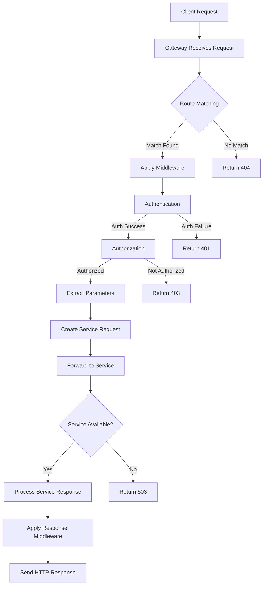

# Gateway Module Specification

The Gateway module serves as an entry point for external clients to interact with backend services. It processes HTTP requests, directs them to the appropriate services, and provides additional features like authentication, routing, and real-time communication support.

## Table of Contents

1. [Overview](#overview)
2. [Core Features](#core-features)
   - [HTTP Server](#http-server)
   - [Routing](#routing)
   - [Authentication](#authentication)
   - [Authorization](#authorization)
3. [Protection Features](#protection-features)
   - [Rate Limiting](#rate-limiting)
   - [CORS](#cors)
   - [Security](#security)
4. [Communication Features](#communication-features)
   - [WebSocket Support](#websocket-support)
   - [Static File Serving](#static-file-serving)
5. [Observability](#observability)
   - [Logging](#logging)
   - [Metrics](#metrics)
   - [Error Handling](#error-handling)
6. [Integration](#integration)
   - [Service Discovery](#service-discovery)
   - [Request Processing](#request-processing)
   - [Response Handling](#response-handling)
7. [Configuration](#configuration)
8. [Programmatic Configuration](#programmatic-configuration)
   - [Gateway Macro](#gateway-macro)
   - [Route Configuration](#route-configuration)
   - [Middleware Configuration](#middleware-configuration)
   - [YAML Integration](#yaml-integration)
9. [Implementation Examples](#implementation-examples)

## Overview

The Gateway module provides:
- HTTP/HTTPS request handling and routing
- Authentication and authorization
- Real-time communication via WebSockets
- Protection against abuse and attacks
- Integration with Kagi node services
- Monitoring and observability features

## Core Features

### HTTP Server

**Capabilities**:
- HTTP/1.1 and HTTP/2 support
- TLS/SSL encryption
- Configurable listening ports and interfaces
- Keep-alive connection support
- Request pipelining
- Graceful shutdown

**Configuration Example**:
```yaml
server:
  host: "0.0.0.0"
  port: 8080
  ssl:
    enabled: true
    cert_file: "/path/to/cert.pem"
    key_file: "/path/to/key.pem"
  keep_alive: true
  shutdown_timeout: 30s
```

### Routing

**Features**:
- Path-based routing
- Method-based routing
- Parameter extraction
- Query string parsing
- Middleware support
- Nested routes

**Example Configuration**:
```yaml
routes:
  - path: "/api/v1/users"
    service: "users"
    methods: ["GET", "POST"]
    middleware: ["auth", "rate_limit"]
    
  - path: "/api/v1/users/:id"
    service: "users"
    methods: ["GET", "PUT", "DELETE"]
    params:
      - name: "id"
        type: "string"
        required: true
```

**Implementation Example**:
```rust
#[derive(Debug, Deserialize)]
pub struct RouteConfig {
    path: String,
    service: String,
    methods: Vec<String>,
    middleware: Option<Vec<String>>,
    params: Option<Vec<ParamConfig>>,
}

impl Gateway {
    pub async fn handle_request(&self, req: Request) -> Result<Response> {
        // Find matching route
        let route = self.router.match_route(req.path(), req.method())?;
        
        // Extract parameters
        let params = route.extract_params(&req)?;

        // Forward to service
        let service_resp = self.context.request(route.service, params).await?;
        
        // Convert to HTTP response
        Ok(service_resp.into_http_response())
    }
}
```

### Authentication

**Supported Methods**:
- Basic Authentication
- Bearer Token (JWT)
- API Key
- OAuth 2.0
- Custom schemes

**JWT Configuration Example**:
```yaml
auth:
  jwt:
    secret: "${JWT_SECRET}"
    algorithms: ["HS256"]
    issuer: "kagi-gateway"
    audience: "kagi-services"
    expiration: 3600  # 1 hour
```

**Implementation Example**:
```rust
#[async_trait]
impl Middleware for JwtAuthMiddleware {
    async fn handle(&self, req: Request, next: Next) -> Result<Response> {
        // Extract token from Authorization header
        let token = self.extract_token(&req)?;
        
        // Validate token
        let claims = self.validate_token(token)?;
        
        // Add claims to request context
        req.set_context("user", claims.user);
        req.set_context("roles", claims.roles);
        
        // Continue processing
        next.run(req).await
    }
}
```

### Authorization

**Features**:
- Role-Based Access Control (RBAC)
- Attribute-Based Access Control (ABAC)
- Permission hierarchies
- Resource-level permissions

**Configuration Example**:
```yaml
authorization:
  roles:
    admin:
      - "*"
    user:
      - "read:*"
      - "write:own"
    guest:
      - "read:public"
      
  resources:
    users:
      - action: "read"
        roles: ["admin", "user"]
      - action: "write"
        roles: ["admin"]
```

## Protection Features

### Rate Limiting

**Algorithms**:
- Fixed Window
- Sliding Window
- Token Bucket
- Leaky Bucket

**Configuration Example**:
```yaml
rate_limit:
  default:
    requests: 100
    window: 60s
  
  rules:
    - path: "/api/v1/users"
      requests: 10
      window: 60s
      
    - path: "/api/v1/search"
      token_bucket:
        rate: 5
        burst: 10
```

**Implementation Example**:
```rust
pub struct TokenBucketLimiter {
    rate: f64,
    burst: u32,
    tokens: AtomicF64,
    last_update: AtomicI64,
}

impl TokenBucketLimiter {
    pub fn try_acquire(&self) -> bool {
        let now = SystemTime::now()
            .duration_since(UNIX_EPOCH)
            .unwrap()
            .as_secs_f64();
            
        let last = self.last_update.load(Ordering::Relaxed) as f64;
        let elapsed = now - last;
        
        // Add new tokens based on elapsed time
        let new_tokens = elapsed * self.rate;
        let current = self.tokens.load(Ordering::Relaxed);
        let updated = (current + new_tokens).min(self.burst as f64);
        
        // Try to take one token
        if updated >= 1.0 {
            self.tokens.store(updated - 1.0, Ordering::Relaxed);
            self.last_update.store(now as i64, Ordering::Relaxed);
            true
        } else {
            false
        }
    }
}
```

### CORS

**Features**:
- Origin validation
- Method restrictions
- Header control
- Credential handling
- Preflight requests

**Configuration Example**:
```yaml
cors:
  allowed_origins: 
    - "https://app.example.com"
    - "https://*.example.com"
  allowed_methods: ["GET", "POST", "PUT", "DELETE"]
  allowed_headers: ["Content-Type", "Authorization"]
  expose_headers: ["X-Request-ID"]
  max_age: 3600
  allow_credentials: true
```

### Security

**Features**:
- TLS/SSL encryption
- XSS protection
- CSRF protection
- SQL injection prevention
- Request validation

**Configuration Example**:
```yaml
security:
  ssl:
    enabled: true
    cert_file: "/path/to/cert.pem"
    key_file: "/path/to/key.pem"
    
  headers:
    X-Frame-Options: "DENY"
    X-XSS-Protection: "1; mode=block"
    Content-Security-Policy: "default-src 'self'"
    
  csrf:
    enabled: true
    methods: ["POST", "PUT", "DELETE"]
    token_header: "X-CSRF-Token"
```

## Communication Features

### WebSocket Support

**Features**:
- Bidirectional real-time communication
- Connection upgrade handling
- Subprotocol negotiation
- Message routing
- Connection management
- Heartbeat monitoring
- Browser-to-backend RPC calls
- Server-sent events to frontend

**Configuration Example**:
```yaml
websocket:
  enabled: true
  path: "/ws"
  subprotocols: ["kagi-v1"]
  heartbeat_interval: 30s
  max_message_size: 65536
  
  routes:
    - path: "/ws/events"
      service: "event_service"
      requires_auth: true
```

**Implementation Example**:
```rust
pub struct WebSocketHandler {
    connections: Arc<RwLock<HashMap<String, WebSocketConnection>>>,
    heartbeat: Duration,
}

impl WebSocketHandler {
    pub async fn handle_connection(&self, socket: WebSocket, id: String) {
        // Store connection
        self.connections.write().await.insert(id.clone(), socket);
        
        // Start heartbeat
        let heartbeat = self.heartbeat;
        tokio::spawn(async move {
            loop {
                tokio::time::sleep(heartbeat).await;
                if let Err(_) = socket.ping().await {
                    break;
                }
            }
        });
        
        // Handle messages
        while let Some(msg) = socket.next().await {
            match msg {
                Ok(Message::Text(text)) => {
                    self.handle_message(&id, text).await;
                }
                Ok(Message::Close(_)) => break,
                _ => continue,
            }
        }
        
        // Clean up
        self.connections.write().await.remove(&id);
    }
}
```

### WebSocket Frontend Integration

**Features**:
- Real-time updates to UI
- Server-to-client push notifications
- Frontend action calls to backend services
- Subscription-based channel updates
- RPC-style request/response
- Authentication and authorization
- Connection resilience with automatic reconnection

**Configuration Example**:
```yaml
websocket:
  enabled: true
  path: "/ws"
  heartbeat_interval: 30s
  authentication:
    required: true
    token_param: "token"
  channels:
    - name: "notifications"
      service: "notification_service"
    - name: "chat"
      service: "chat_service"
    - name: "data-sync"
      service: "sync_service"
```

**Implementation Example**:
```rust
impl Gateway {
    async fn handle_websocket_connection(
        &self,
        ws: WebSocket,
        token: Option<String>,
        channels: Vec<String>
    ) -> Result<(), Error> {
        // Validate token if required
        if self.config.websocket.authentication.required {
            if let Some(token) = token {
                let valid = self.auth_service.validate_token(&token).await?;
                if !valid {
                    return Err(Error::Unauthorized);
                }
            } else {
                return Err(Error::Unauthorized);
            }
        }
        
        // Subscribe to requested channels
        for channel in channels {
            if let Some(service) = self.config.websocket.get_service_for_channel(&channel) {
                self.subscribe_to_channel(&ws, &channel, service).await?;
            }
        }
        
        // Process messages
        self.process_websocket_messages(ws).await
    }
    
    async fn subscribe_to_channel(
        &self, 
        ws: &WebSocket,
        channel: &str,
        service: &str
    ) -> Result<(), Error> {
        // Send subscription request to service
        let response = self.context
            .request(service, "subscribe", { channel: channel.to_string() })
            .await?;
            
        // Set up event handler for updates
        self.event_bus.on(format!("{}.update", channel), move |data| {
            ws.send(data).await
        });
        
        Ok(())
    }
    
    async fn handle_action_call(&self, ws: &WebSocket, id: &str, action: &str, params: Value) -> Result<(), Error> {
        // Call action on appropriate service
        let result = self.context.request_with_meta(action, params, {}).await;
        
        // Send result back to client
        match result {
            Ok(data) => {
                ws.send(json!({
                    "id": id,
                    "success": true,
                    "data": data
                })).await?;
            },
            Err(err) => {
                ws.send(json!({
                    "id": id,
                    "success": false,
                    "error": {
                        "message": err.to_string(),
                        "code": err.code(),
                    }
                })).await?;
            }
        }
        
        Ok(())
    }
}
```

**Client-side Integration Example**:
```javascript
// Frontend connection to WebSocket endpoint
const socket = new WebSocket('wss://api.example.com/ws?token=JWT_TOKEN');

// Handle connection events
socket.onopen = () => {
  console.log('Connected to server');
  
  // Subscribe to channels
  socket.send(JSON.stringify({
    type: 'subscribe',
    channels: ['notifications', 'chat']
  }));
  
  // Call backend action
  socket.send(JSON.stringify({
    type: 'action',
    id: '1234',
    action: 'users.profile',
    params: { userId: 'current' }
  }));
};

// Handle incoming messages
socket.onmessage = (event) => {
  const message = JSON.parse(event.data);
  
  if (message.type === 'event') {
    // Handle event (server push)
    console.log('Event received:', message.event, message.data);
    updateUI(message.data);
  } else if (message.id === '1234') {
    // Handle response to our action call
    if (message.success) {
      console.log('Action result:', message.data);
    } else {
      console.error('Action error:', message.error);
    }
  }
};

// Handle reconnection
socket.onclose = () => {
  console.log('Connection closed, reconnecting...');
  setTimeout(connectWebSocket, 1000);
};
```

### Static File Serving

**Features**:
- Serving static files from the file system
- Cache control
- Content type negotiation
- Directory listing

**Configuration Example**:
```yaml
static_file_serving:
  enabled: true
  root_dir: "/path/to/static"
  cache_control: "public, max-age=3600"
```

## Observability

### Logging

**Features**:
- Structured logging
- Log levels
- Request/response logging
- Error logging
- Performance logging

**Configuration Example**:
```yaml
logging:
  level: "info"
  format: "json"
  output: "stdout"
  
  request_logging:
    enabled: true
    include_headers: true
    include_body: false
```

### Metrics

**Features**:
- Request counts
- Response times
- Error rates
- Connection stats
- Custom metrics

**Implementation Example**:
```rust
#[derive(Default)]
pub struct Metrics {
    requests_total: Counter,
    request_duration: Histogram,
    errors_total: Counter,
    active_connections: Gauge,
}

impl Metrics {
    pub fn record_request(&self, duration: Duration, status: u16) {
        self.requests_total.inc();
        self.request_duration.observe(duration.as_secs_f64());
        
        if status >= 500 {
            self.errors_total.inc();
        }
    }
}
```

## Integration

### Service Discovery

**Methods**:
- Static configuration
- Service registry
- DNS-based discovery
- Dynamic updates
- P2P network discovery

**Configuration Example**:
```yaml
service_discovery:
  type: "registry"
  registry:
    url: "http://registry:8500"
    service_prefix: "kagi-"
    refresh_interval: 30s
  p2p:
    enabled: true
    networks:
      - id: "${NETWORK_ID}"
        bootstrap_peers:
          - "peer1.example.com:4433"
          - "peer2.example.com:4433"
    authentication:
      token_header: "X-P2P-Token"
      network_header: "X-Network-ID"
```

### Request Processing

The following diagram illustrates the request processing flow in the Gateway:



1. Receive HTTP request
2. Match route
3. Apply middleware
4. Extract parameters
5. Create service request
6. Forward to service
7. Process response
8. Send HTTP response

**Implementation Example**:
```rust
impl Gateway {
    pub async fn process_request(&self, http_req: HttpRequest) -> Result<HttpResponse> {
        // Match route
        let route = self.router.match_route(http_req.uri(), http_req.method())?;
        
        // Apply middleware
        let (req, ctx) = self.apply_middleware(http_req, &route.middleware).await?;
        
        // Create service request
        let service_req = ServiceRequest::builder()
            .operation(route.operation)
            .params(route.extract_params(&req)?)
            .context(ctx)
            .build()?;
            
        // Forward to service
        let service_resp = self.service_client
            .send_request(&route.service, service_req)
            .await?;
            
        // Convert to HTTP response
        Ok(service_resp.into_http_response())
    }
}
```

### P2P Gateway Support

**Features**:
- P2P request routing
- Network-specific access control
- DHT integration

**Implementation Example**:
```rust
impl Gateway {
    async fn handle_p2p_request(&self, req: HttpRequest) -> Result<HttpResponse, Error> {
        // Extract P2P-specific headers
        let peer_id = self.extract_peer_id(&req)?;
        let network_id = self.extract_network_id(&req)?;
        let token = self.extract_token(&req)?;
        
        // Validate P2P access
        if !self.p2p.validate_peer_token(peer_id, network_id, &token).await? {
            return Err(Error::Unauthorized);
        }
        
        // Handle DHT operations if specified
        if let Some(dht_op) = self.extract_dht_operation(&req) {
            return self.handle_dht_operation(dht_op, network_id).await;
        }
        
        // Forward request to P2P network
        let response = self.p2p
            .send_to_peer(peer_id, req.into_inner())
            .await?;
            
        Ok(response.into())
    }
    
    async fn handle_dht_operation(
        &self,
        operation: DHTOperation,
        network_id: NetworkId
    ) -> Result<HttpResponse, Error> {
        match operation {
            DHTOperation::Get { key } => {
                let value = self.p2p.dht_get(network_id, key).await?;
                Ok(HttpResponse::Ok().json(value))
            }
            DHTOperation::Put { key, value } => {
                self.p2p.dht_put(network_id, key, value).await?;
                Ok(HttpResponse::Ok().finish())
            }
        }
    }
}
```

## Configuration

The Gateway is configured through YAML files and environment variables:

```yaml
gateway:
  server:
    host: "0.0.0.0"
    port: 8080
    
  services:
    user_service:
      url: "http://user-service:8081"
      timeout: 5s
      retry:
        max_attempts: 3
        backoff: 100ms
        
  auth:
    jwt:
      secret: "${JWT_SECRET}"
      expiration: 3600
      
  rate_limit:
    enabled: true
    default_rate: 100
    default_burst: 50
    
  cors:
    allowed_origins: ["https://*.example.com"]
    
  metrics:
    enabled: true
    path: "/metrics"
```

## Programmatic Configuration

The Gateway can be configured programmatically using macros that integrate seamlessly with the Kagi node system. This approach allows for defining routes, middleware, and other gateway features directly in the application code.

### Gateway Macro

The `#[gateway]` macro defines a new gateway service with configuration options. This macro can be applied to a struct that will serve as the gateway implementation.

**Basic Gateway Definition**:

```rust
use kagi_macros::gateway;

#[gateway(
    host = "0.0.0.0",
    port = 8080,
    services = [UserService, ProfileService, AuthService]
)]
pub struct ApiGateway;

#[init]
impl ApiGateway {
    pub async fn new() -> Result<Self> {
        Ok(Self {})
    }
}
```

**Full Gateway Configuration**:

```rust
use kagi_macros::gateway;

#[gateway(
    host = "0.0.0.0",
    port = 8080,
    services = [UserService, ProfileService, AuthService],
    ssl = { enabled = true, cert_file = "/path/to/cert.pem", key_file = "/path/to/key.pem" },
    cors = { allowed_origins = ["https://app.example.com"], allow_credentials = true },
    rate_limit = { default_rate = 100, default_burst = 50 },
    auth = { jwt_secret = "${JWT_SECRET}", expiration = 3600 }
)]
pub struct ApiGateway;
```

**YAML-based Configuration**:

```rust
use kagi_macros::gateway;

#[gateway(config_file = "config/gateway.yml")]
pub struct ApiGateway;
```

### Route Configuration

Routes can be defined using the `#[route]` macro on gateway implementation methods. This allows for direct mapping of HTTP routes to service actions.

**Basic Route Definition**:

```rust
use kagi_macros::{gateway, route};

#[gateway(...)]
pub struct ApiGateway;

impl ApiGateway {
    #[route(GET, "/api/users")]
    async fn get_users(&self) -> Result<Vec<User>> {
        self.context.request("user_service", "get_users", {}).await
    }
    
    #[route(POST, "/api/users")]
    async fn create_user(&self, user: User) -> Result<User> {
        self.context.request("user_service", "create_user", { user }).await
    }
    
    #[route(GET, "/api/users/:id")]
    async fn get_user(&self, id: Uuid) -> Result<User> {
        self.context.request("user_service", "get_user", { id }).await
    }
}
```

**Route with Middleware**:

```rust
impl ApiGateway {
    #[route(GET, "/api/profile", middleware = [auth])]
    async fn get_profile(&self, token: String) -> Result<Profile> {
        let user = self.context.request("auth_service", "validate_token", { token }).await?;
        self.context.request("profile_service", "get_profile", { user_id: user.id }).await
    }
}
```

**REST API to Service Mapping**:

```rust
use kagi_macros::{gateway, rest_api};

#[gateway(...)]
pub struct ApiGateway;

#[rest_api(
    prefix = "/api/v1",
    service = "user_service"
)]
impl ApiGateway {
    #[action(GET, "/users")]
    async fn get_users(&self) -> Result<Vec<User>> {
        // Maps to user_service.get_users()
    }
    
    #[action(POST, "/users")]
    async fn create_user(&self, user: User) -> Result<User> {
        // Maps to user_service.create_user(user)
    }
    
    #[action(GET, "/users/:id")]
    async fn get_user(&self, id: Uuid) -> Result<User> {
        // Maps to user_service.get_user(id)
    }
    
    #[action(PUT, "/users/:id")]
    async fn update_user(&self, id: Uuid, user: User) -> Result<User> {
        // Maps to user_service.update_user(id, user)
    }
}
```

### Middleware Configuration

Middleware can be defined and configured using the `#[middleware]` macro. This allows for processing requests and responses in a chainable manner.

**Basic Middleware Definition**:

```rust
use kagi_macros::middleware;

#[middleware]
pub struct AuthMiddleware;

impl AuthMiddleware {
    #[action]
    async fn handle_request(&self, req: &mut Request, next: Next) -> Result<Response> {
        let token = req.headers()
            .get("Authorization")
            .and_then(|h| h.to_str().ok())
            .and_then(|s| s.strip_prefix("Bearer "))
            .ok_or_else(|| Error::Unauthorized("Missing token".into()))?;
        
        // Validate token
        let user = self.context
            .request("auth_service", "validate_token", { token: token.to_string() })
            .await?;
        
        // Add user to request context
        req.set_context("user", user);
        
        // Continue processing
        next.run(req).await
    }
}
```

**Middleware Registration**:

```rust
use kagi_macros::gateway;

#[gateway(
    host = "0.0.0.0",
    port = 8080,
    middleware = [
        AuthMiddleware::new(),
        RateLimitMiddleware::new(100, 50),
        LoggingMiddleware::new("info")
    ]
)]
pub struct ApiGateway;
```

### YAML Integration

The gateway can be configured to load specific settings from a YAML file while keeping others defined programmatically.

**Mixed Configuration**:

```rust
use kagi_macros::gateway;

#[gateway(
    config_file = "config/gateway.yml",
    services = [UserService, ProfileService, AuthService]
)]
pub struct ApiGateway;
```

With a corresponding YAML file:

```yaml
# config/gateway.yml
server:
  host: "0.0.0.0"
  port: 8080
  ssl:
    enabled: true
    cert_file: "/path/to/cert.pem"
    key_file: "/path/to/key.pem"

cors:
  allowed_origins: ["https://app.example.com"]
  allow_credentials: true

auth:
  jwt:
    secret: "${JWT_SECRET}"
    expiration: 3600
```

## Implementation Examples

### Complete Gateway Service Example

```rust
use kagi_macros::{gateway, route, middleware, init, service};
use anyhow::Result;
use uuid::Uuid;

#[service]
#[gateway(
    host = "0.0.0.0",
    port = 8080,
    services = [UserService, ProfileService, AuthService],
    cors = { allowed_origins = ["https://app.example.com"] }
)]
pub struct ApiGateway;

#[init]
impl ApiGateway {
    pub async fn new() -> Result<Self> {
        Ok(Self {})
    }
}

impl ApiGateway {
    // Public endpoints
    #[route(POST, "/api/auth/login")]
    async fn login(&self) -> Result<AuthResponse> {
        self.context.request("auth_service", "login", {}).await
    }
    
    #[route(POST, "/api/auth/register")]
    async fn register(&self, user_data: RegisterRequest) -> Result<AuthResponse> {
        self.context.request("auth_service", "register", { user_data }).await
    }
    
    // Protected endpoints
    #[route(GET, "/api/users", middleware = [auth])]
    async fn get_users(&self) -> Result<Vec<User>> {
        self.context.request("user_service", "get_users", {}).await
    }
    
    #[route(GET, "/api/users/:id", middleware = [auth])]
    async fn get_user(&self, id: Uuid) -> Result<User> {
        self.context.request("user_service", "get_user", { id }).await
    }
    
    #[route(GET, "/api/profile", middleware = [auth])]
    async fn get_profile(&self, #[from_context] user: User) -> Result<Profile> {
        self.context.request("profile_service", "get_profile", { user_id: user.id }).await
    }
    
    #[route(PATCH, "/api/profile", middleware = [auth])]
    async fn update_profile(&self, #[from_context] user: User, data: UpdateProfileRequest) -> Result<Profile> {
        self.context.request("profile_service", "update_profile", { user_id: user.id, data }).await
    }
}

// Auth middleware
#[middleware]
pub struct AuthMiddleware;

impl AuthMiddleware {
    #[action]
    async fn handle_request(&self, req: &mut Request, next: Next) -> Result<Response> {
        let token = req.headers()
            .get("Authorization")
            .and_then(|h| h.to_str().ok())
            .and_then(|s| s.strip_prefix("Bearer "))
            .ok_or_else(|| Error::Unauthorized("Missing token".into()))?;
        
        // Validate token
        let user = self.context
            .request("auth_service", "validate_token", { token: token.to_string() })
            .await?;
        
        // Add user to request context
        req.set_context("user", user);
        next.run(req).await
    }
}
```

### Main Application Entry Point

```rust
use kagi_macros::{main};
use kagi_node::Node;

mod user_service;
mod auth_service;
mod profile_service;
mod api_gateway;

use user_service::UserService;
use auth_service::AuthService;
use profile_service::ProfileService;
use api_gateway::ApiGateway;

#[main]
async fn main() -> Result<()> {
    // Create and initialize node
    let mut node = Node::new(kagi_node::NodeConfig {
        node_id: "api_node".to_string(),
        data_dir: "./data".to_string(),
        db_path: "./data/db".to_string(),
        p2p_config: None, // Configure if P2P is needed
    }).await?;
    
    // Initialize services
    let user_service = UserService::new().await?;
    let auth_service = AuthService::new().await?;
    let profile_service = ProfileService::new().await?;
    let api_gateway = ApiGateway::new().await?;
    
    // Register services with the node
    node.register_service("user_service", user_service).await?;
    node.register_service("auth_service", auth_service).await?;
    node.register_service("profile_service", profile_service).await?;
    node.register_service("api_gateway", api_gateway).await?;
    
    // Start the node which will manage all services
    node.start().await?;
    
    // Wait for the node to complete (typically runs until interrupted)
    node.wait_for_shutdown().await?;
    
    Ok(())
}
```

This improved specification provides a comprehensive guide for implementing the Gateway module, with clear examples and implementation details that integrate well with the Kagi node system.


## Examples

This section will be expanded with practical examples.
