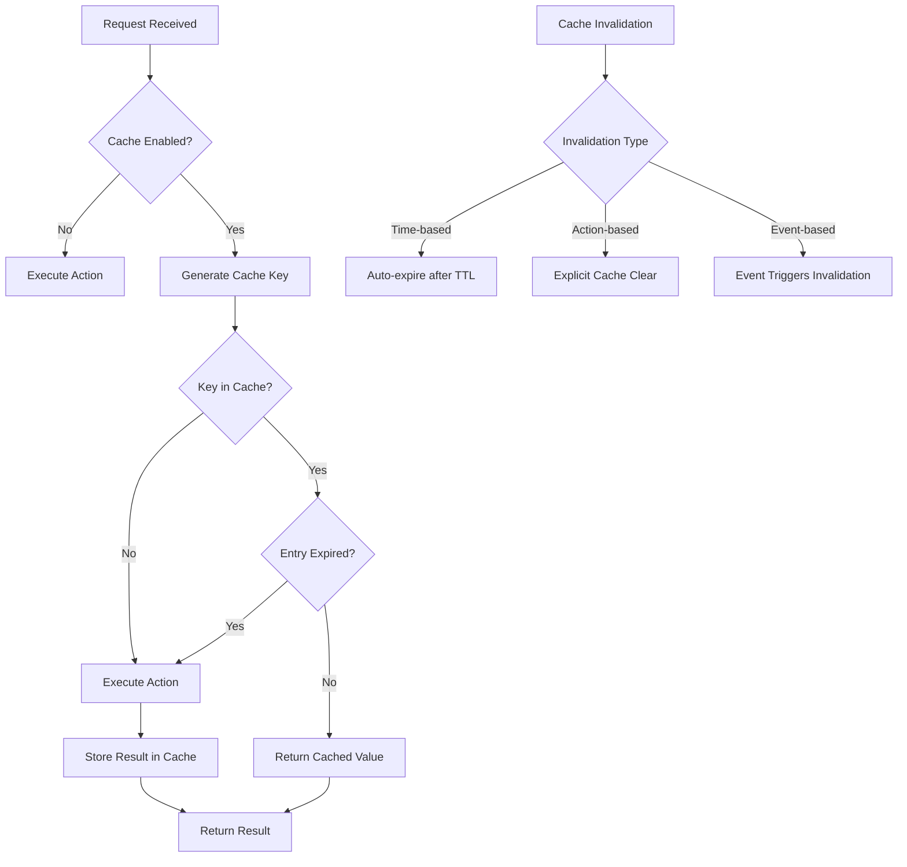

# Caching Feature Specification

The caching feature enables the storage and retrieval of frequently accessed data to enhance application performance by reducing redundant computations or database queries. It provides a configurable, extensible caching system that integrates seamlessly with services, supporting multiple storage backends and offering robust mechanisms for cache management.

## Table of Contents

1. [Introduction](#introduction)
2. [Cache Storage](#cache-storage)
3. [Configuration](#configuration)
4. [Cache Operations](#cache-operations)
5. [Cache Key Generation](#cache-key-generation)
6. [Cache Invalidation](#cache-invalidation)
7. [Integration with Services](#integration-with-services)
   - [Declarative Caching](#declarative-caching)
   - [Transparent Operation](#transparent-operation)
   - [Automatic Cache Management Actions](#automatic-cache-management-actions)
8. [Error Handling](#error-handling)
9. [Performance Considerations](#performance-considerations)
10. [Security](#security)
11. [Monitoring and Logging](#monitoring-and-logging)
12. [Implementation Notes](#implementation-notes)
13. [Examples](#examples)
    - [Configuration Example](#configuration-example)
    - [Service Definition Example](#service-definition-example)
    - [Cache Invalidation Example](#cache-invalidation-example)

## Introduction

The caching feature enables the storage and retrieval of frequently accessed data to enhance application performance by reducing redundant computations or database queries. It provides a configurable, extensible caching system that integrates seamlessly with services, supporting multiple storage backends and offering robust mechanisms for cache management.

## Cache Storage

**Description**: The system supports multiple cache storage backends to suit different scalability and performance needs.

**Supported Backends**:
- **In-memory Cache**: A lightweight, fast cache stored in the application's memory (e.g., using a hash map)
- **DHT Cache**: A distributed cache using the P2P network's DHT system
- **Custom Backends**: Users can implement and integrate custom cache stores, including third-party solutions like Redis if needed

**Configuration**: The backend is selectable via configuration files (e.g., JSON/YAML) or environment variables (e.g., `CACHE_BACKEND=dht`).

### DHT Cache Backend

When using the DHT as a cache backend, the system:
- Stores cache entries in the current network's DHT (network ID retrieved from context)
- Uses TTL-based expiration through DHT value expiration
- Provides automatic replication across peers
- Supports network-specific cache isolation

**DHT Cache Configuration**:
```yaml
cache:
  backend: dht
  replication: 3     # Number of replicas
  ttl: 3600          # Default TTL in seconds
  prefix: "cache:"   # Key prefix in DHT
```

## Configuration

### Global Configuration:
- Enable or disable caching system-wide
- Set a default TTL (Time To Live) for cache entries (e.g., 30 seconds)

### Service-Level Configuration:
- Override global settings for specific services
- Example: Enable caching only for a subset of services

### Action-Level Configuration:
- Enable/disable caching per action
- Specify custom TTL or caching conditions per action
- Example: `#[action(cache(enabled = true, ttl = 60))]`

## Cache Operations

The following diagram illustrates the cache operations flow:



### System-Level API:
- `set(key, value, ttl)`: Stores a value in the cache with a specified key and optional TTL (in seconds)
- `get(key)`: Retrieves the value associated with the key, returning null if not found or expired
- `delete(key)`: Removes a specific cache entry
- `clear()`: Deletes all entries in the cache

**Note**: These methods are available internally to the caching system but are not intended for direct use by service implementations. Services should use the auto-generated cache management actions.

## Cache Key Generation

**Automatic Generation**: Unique keys are generated based on the action name and its parameters (e.g., `getUser:123` for action `getUser` with parameter `id=123`)

**Custom Keys**: Users can define custom keys or provide a key generation function (e.g., `key: (params) => "custom:" + params.id`)

## Cache Invalidation

**Time-based**: Entries expire automatically after their TTL

**Action-based Invalidation**: Cache entries are invalidated using the auto-generated cache management actions:
- `<service>/cache/clear`: Clear all cache entries for the service
- `<service>/cache/delete`: Delete a specific cache entry by key
- `<service>/cache/revoke`: Revoke cache entries by pattern matching

**Event-based**: Invalidate cache entries when specific events occur (e.g., a `user.updated` event clears related cache keys)
- Configurable via event mappings (e.g., `{ event: "user.updated", keys: ["getUser:*"] }`)

## Integration with Services

### Declarative Caching

Enable caching for actions using macros:
- Example: `#[cached(ttl = 60)]` or `#[action(cache(enabled = true, ttl = 60))]` in service definitions

> **Note**: Runar macros support both compile-time (distributed slices) and runtime registration approaches, making them fully compatible with testing environments without requiring unstable Rust features.

### Transparent Operation

Caching operates transparently to service implementations:

1. When a request is received, the caching system checks if a valid cache entry exists
2. If a cache hit occurs, the cached result is returned immediately without invoking the action handler
3. If a cache miss occurs, the action handler is invoked and its result is stored in the cache

This means service implementations don't need to handle caching logic directly - the system manages it automatically.

### Automatic Cache Management Actions

When caching is enabled for a service, the system automatically adds the following cache management actions:

- `<service>/cache/clear`: Clears all cache entries for the service
- `<service>/cache/delete`: Deletes a specific cache entry by key
- `<service>/cache/revoke`: Revokes cache entries by pattern matching

Example for a `user` service:
```
user/cache/clear                                  -> Clears all user service cache entries
user/cache/delete {key: "get_user:123"}          -> Deletes specific cache entry
user/cache/revoke {pattern: "get_user:*"}        -> Invalidates all cache entries matching the pattern
```

These automatically generated endpoints provide a complete interface for cache management and can be used by services, admin interfaces, or for troubleshooting.

### P2P Cache Integration

When using the DHT cache backend, the system integrates with the P2P transport layer:

1. **DHT Storage**:
   ```rust
   impl DHTCacheBackend {
       async fn set(&self, key: String, value: Vec<u8>, ttl: Duration) -> Result<()> {
           // Get network_id from context
           let network_id = self.context.network_id();
           
           // Store in current network's DHT
           self.p2p.dht_put(
               network_id,
               format!("{}:{}", self.prefix, key),
               CacheEntry {
                   value,
                   expires_at: SystemTime::now() + ttl,
               }.serialize()
           ).await
       }
       
       async fn get(&self, key: String) -> Result<Option<Vec<u8>>> {
           // Get network_id from context
           let network_id = self.context.network_id();
           
           // Retrieve from current network's DHT
           if let Some(data) = self.p2p.dht_get(
               network_id,
               format!("{}:{}", self.prefix, key)
           ).await? {
               let entry: CacheEntry = deserialize(&data)?;
               if entry.expires_at > SystemTime::now() {
                   return Ok(Some(entry.value));
               }
           }
           Ok(None)
       }
   }
   ```

2. **Network Events**:
   - Subscribe to network events for cache invalidation
   - Handle peer join/leave events for replication
   - Coordinate cache updates across peers

3. **Replication Strategy**:
   ```rust
   impl DHTCacheBackend {
       async fn ensure_replication(&self, key: String) -> Result<()> {
           // Get network_id from context
           let network_id = self.context.network_id();
           
           let peers = self.p2p.get_network_peers(network_id).await?;
           if peers.len() < self.config.replication {
               // Trigger replication to new peers
               self.replicate_cache_entry(key).await?;
           }
           Ok(())
       }
       
       async fn replicate_cache_entry(&self, key: String) -> Result<()> {
           if let Some(entry) = self.get(key.clone()).await? {
               // Get network_id from context
               let network_id = self.context.network_id();
               
               // Replicate to additional peers
               self.p2p.dht_put_replicated(
                   network_id,
                   format!("{}:{}", self.prefix, key),
                   entry,
                   self.config.replication
               ).await?;
           }
           Ok(())
       }
   }
   ```

4. **Cache Consistency**:
   - Use DHT's eventual consistency model
   - Handle conflicts through timestamp-based resolution
   - Propagate invalidations across the network

## Error Handling

**Fallback Mechanism**: If the cache backend is unavailable or fails, the system bypasses the cache and fetches data directly

**Error Logging**: Cache-related errors (e.g., connection failures) are logged for debugging, without disrupting service operation

## Performance Considerations

**Low Overhead**: Cache operations are optimized for speed, using asynchronous methods where applicable

**In-memory Priority**: Recommend in-memory caching for low-latency scenarios, with custom backends for scalability

**Concurrency**: Ensure thread-safe access for in-memory caches in multi-threaded environments

## Security

**Data Sensitivity**: Avoid caching sensitive data unless explicitly secured

**External Backends**: Use encrypted connections when caching data externally with custom backends

**Access Control**: Restrict cache access to authorized services or processes

## Monitoring and Logging

**Metrics**: Provide optional metrics for cache performance (e.g., hit rate, miss rate, operation latency)

**Logging**: Log cache events (e.g., hits, misses, errors) for debugging and optimization
- Example: `Cache hit: getUser:123`, `Cache miss: getUser:456`

## Implementation Notes

**Extensibility**: The system allows plugging in custom cache backends via a defined interface (e.g., `{ get, set, delete, clear }`)

**Minimal Impact**: Caching logic is decoupled from business logic, ensuring clean service code

**Scalability**: Support for distributed caches ensures compatibility with multi-node deployments

## Examples

### Configuration Example

```json
{
  "cache": {
    "enabled": true,
    "backend": "dht",
    "ttl": 30,
    "replication": 3,
    "prefix": "cache:"
  },
  "services": {
    "user": {
      "actions": {
        "get_user": {
          "cache": {
            "enabled": true,
            "ttl": 60,
            "keys": ["id"]
          }
        }
      }
    }
  }
}
```

### Service Definition Example

```rust
use runar_node::prelude::*;

// Define service with caching using macros
#[runar_macros::service]
struct UserService {
    #[inject]
    db_connection: DatabaseConnection,
}

impl UserService {
    // Cached action with custom TTL using the action macro with cache attributes
    #[action(cache(enabled = true, ttl = 60))]
    async fn get_user(&self, context: &RequestContext, id: u64) -> Result<User> {
        // This will only be called on cache miss
        // The caching system has already checked for a cached result before calling this method
        let user = self.db_connection.query_one("SELECT * FROM users WHERE id = ?", &[id]).await?;
        Ok(user)
    }
    
    // Alternative syntax with dedicated cached macro
    #[action]
    #[cached(ttl = 60)]
    async fn get_user_profile(&self, context: &RequestContext, id: u64) -> Result<UserProfile> {
        let profile = self.db_connection.query_one("SELECT * FROM profiles WHERE user_id = ?", &[id]).await?;
        Ok(profile)
    }
    
    // Action that invalidates cache
    #[action]
    async fn update_user(&self, context: &RequestContext, id: u64, data: UserData) -> Result<User> {
        let user = self.db_connection.update("users", id, &data).await?;
        
        // Invalidate the cache for this user using the cache management action
        let params = vmap! {
            "key" => format!("get_user:{}", id)
        };
        context.request("user/cache/delete", params).await?;
        
        // Publish event that will trigger cache invalidation rules
        context.publish("user.updated", json!({ "id": id })).await?;
        
        Ok(user)
    }
}
```

### Cache Invalidation Example

Here's how cache invalidation works in practice:

```rust
// Example of handling an update that requires cache invalidation
#[action]
async fn update_profile(&self, context: &RequestContext, user_id: u64, profile_data: ProfileData) -> Result<Profile> {
    // Update the profile in the database
    let updated_profile = self.db.update_profile(user_id, &profile_data).await?;
    
    // Invalidate specific cache entry using the cache management action
    let params = vmap! {
        "key" => format!("get_profile:{}", user_id)
    };
    context.request("profile/cache/delete", params).await?;
    
    // For invalidating multiple related entries:
    let params = vmap! {
        "pattern" => format!("profile:user:{}:*", user_id)
    };
    context.request("profile/cache/revoke", params).await?;
    
    Ok(updated_profile)
}
```

This caching system design ensures:

1. Separation of concerns - services don't need to manage cache directly
2. Performance - cached results are returned without invoking handlers
3. Consistency - cache invalidation is handled through standard service actions
4. Manageability - all cache operations are available as standard service actions
5. Flexibility - configurable at global, service, and action levels

### DHT Cache Example

```yaml
# DHT cache configuration
cache:
  backend: dht
  replication: 3
  ttl: 3600
  prefix: "cache:"
  consistency:
    strategy: "eventual"
    conflict_resolution: "last_write_wins"
```

```rust
// Service using DHT cache
#[service]
struct ProfileService {
    #[inject]
    db: Database,
}

impl ProfileService {
    // Using DHT cache with the cached macro
    #[action]
    #[cached(backend = "dht", ttl = 60)]
    async fn get_user_profile(&self, context: &RequestContext, user_id: String) -> Result<Profile> {
        // Function implementation
        // Network ID automatically retrieved from context
        // Caching handled automatically by the system
        let profile = self.db.get_profile(user_id).await?;
        Ok(profile)
    }

    // Manual cache management
    #[action]
    async fn update_profile(&self, context: &RequestContext, user_id: String, profile: Profile) -> Result<()> {
        // Update profile
        self.db.update_profile(user_id.clone(), profile).await?;
        
        // Invalidate cache within the current network using vmap! to create parameters
        context.request(
            "profile/cache/delete",
            vmap! {
                "key" => format!("get_user_profile:{}", user_id)
            }
        ).await?;
        
        Ok(())
    }
}
```
